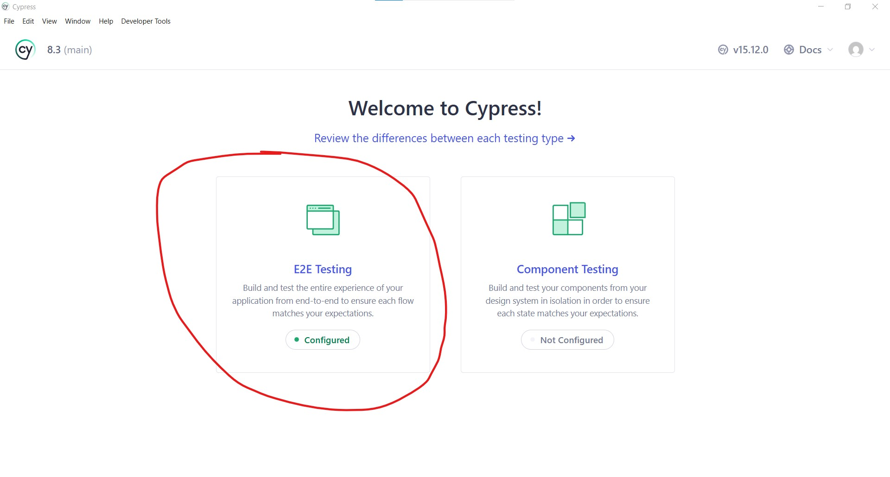
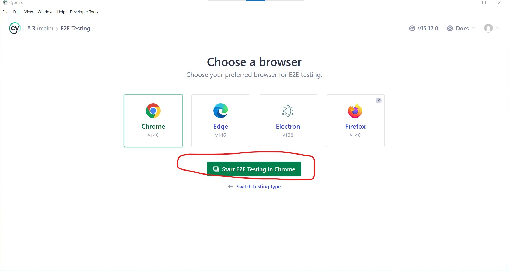
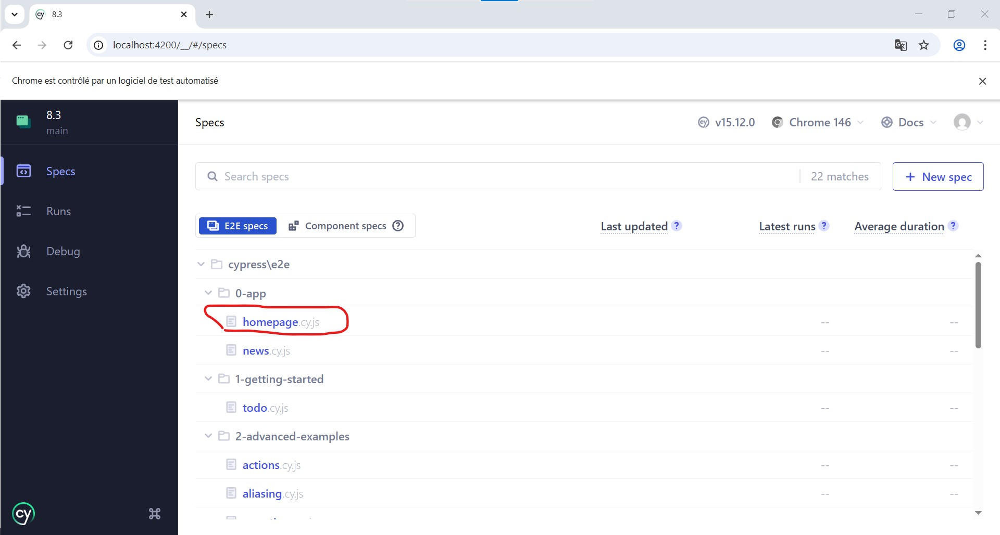
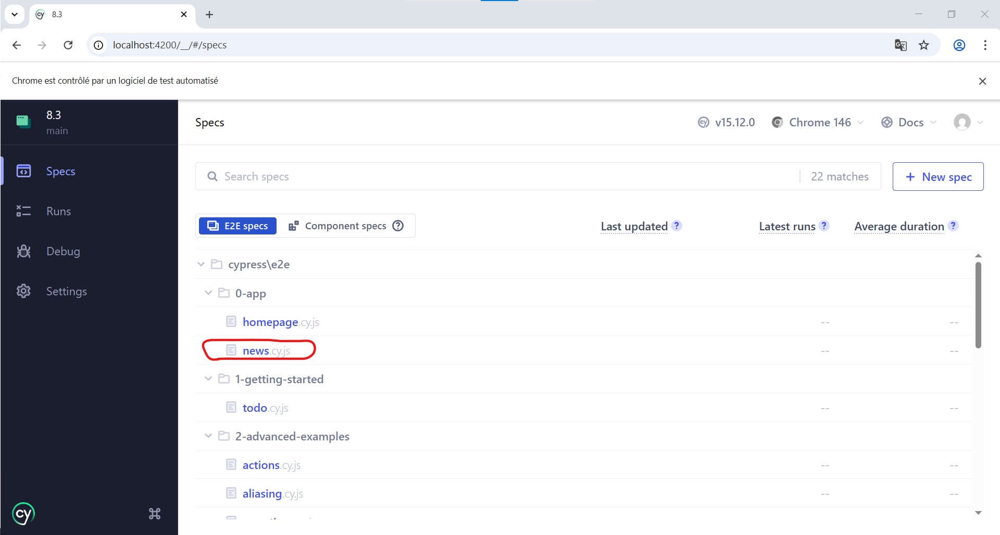
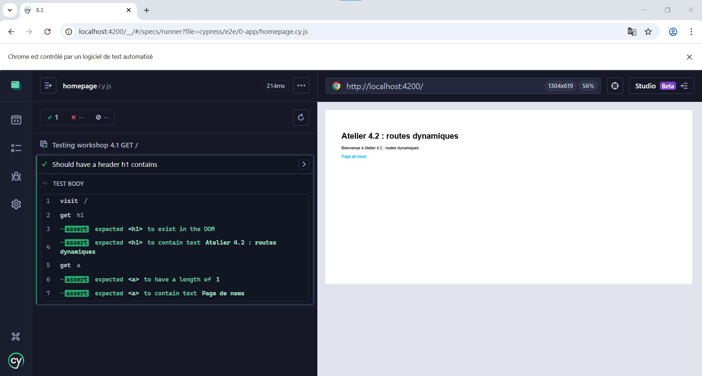
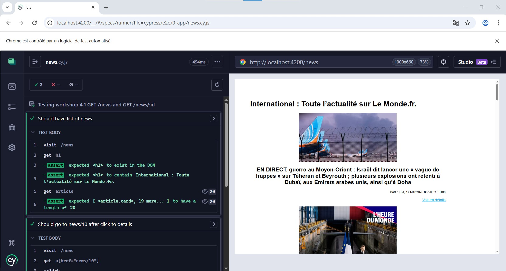

# Correction exercice 7.3 : Tests End To End de l'exercice 5.3

## Installation et lancement des tests

Pour lancer les tests fonctionnelles avec Cypress

1. Lancez le serveur de l'exercice 5.1 au préalable qui tourne normalement sur le PORT 4200, si ce n'est pas le cas pour vous, changer l'information au niveau de l'exercice 5.1 en mettant le port 4200 pour la variable d'environnement dédiée ou modifiez *cypress.config.js* en remplaçant le port 4200 par le port local de votre exercice 5.1.

2. Exécutez la commande `npm install`

3. Exécutez la commande `npm run test:e2e`

4. En cas d'alerte du pare-feu windows, autorisez

5. Une fenêtre s'ouvre, cliquez sur E2E

6. Cliquez sur le dossier *0-app/* dans le menu de navigation de gauche et cliquez sur le fichier *homepage.cy.js* pour lancer les tests 

7. Revenez en arrière en cliquant sur le menu lateral gauche le premier icône "Specs" puis cliquez sur *news.cy.js* pour lancer également les tests.

PS : il existe un mode background sans lancer un navigateur Web pour lancer vos tests e2e et avoir des vidéos et/ou des captures d'écrans des erreurs [cf. documentation](https://docs.cypress.io/app/continuous-integration/overview)

---

## Illustrations et guide interface Cypress






---

## Résultats des tests




---

## Fichiers sources

<!-- AUTO-GENERATED -->

### exercices/corrections/7.3

#### `exercices/corrections/7.3/app.js`

```javascript
const createError = require('http-errors');
const express = require('express');
const path = require('path');
const cookieParser = require('cookie-parser');
const logger = require('morgan');

const indexRouter = require('./routes/index');
const newsRouter = require('./routes/news');

const app = express();


app.set('views', path.join(__dirname, 'views'));
app.set('view engine', 'pug');

app.use(logger('dev'));
app.use(express.json());
app.use(express.urlencoded({ extended: false }));
app.use(cookieParser());
app.use(express.static(path.join(__dirname, 'public')));

app.use('/', indexRouter);
app.use('/news', newsRouter);

app.use(function(req, res, next) {
  next(createError(404));
});

app.use(function(err, req, res, next) {
  res.locals.message = err.message;
  res.locals.error = req.app.get('env') === 'development' ? err : {};
  res.status(err.status || 500);
  res.render('error');
});

module.exports = app;

```

#### `exercices/corrections/7.3/controllers/news.js`

```javascript
const { readFile } = require('fs/promises')
const { join } = require('path')
const jsonFile = join(__dirname, '../public', 'data', 'news.json')

// Un middleware, on verra en détails un peu plus tard
const checkID = (req, res, next) => {
  const id = req.params.id
  // test si id est numérique
  if (req.params.id && !/\d+/.test(req.params.id)) {
    res.status(400)
    throw new Error(`${id} must be a number`)
  }
  next()
}

const findAll = (_, res) => {
  getContent(jsonFile)
  .then(({ articles, title }) => { // décomposition idem que .then((data) => { const articles = data.articles; const title = data.title})
    res.render('news/list',{ articles, title })
  }).catch(error => res.render('error', { message : error.message}))
}

const findOne = (req, res) => {
  const id = req.params.id
  getContent(jsonFile)
  .then(({ articles }) => {
    const article = articles.find(item => item.id == id)
    if(article) res.render('news/single', article)
    else res.status(404).render('error', { message: `No items with ID ${id}`})
  }).catch(error => res.render('error', { message : error.message}))
}

const getContent = async (filename, charset='utf-8') => {
  return readFile(filename, charset)
  .then((data) => {
    const news = JSON.parse(data)
    // Depuis news.rss.channel on décompose pour récupérer item et title
    const { item, title } = news.rss.channel // idem que const item = news.rss.channel.item et title = news.rss.channel.title
    const articles = item.map(article => {
      const { title, id, pubDate, description, link } = article
      const credit = article.content.credit?.__text??'NC'
      const enclosure = article.content._url
      return { id, title, pubDate, enclosure, description, credit, link }
    })
    return { articles, title }
  })
  .catch(error => error)
}

module.exports = {
  checkID,
  findOne,
  findAll
}
```

#### `exercices/corrections/7.3/cypress.config.js`

```javascript
import { defineConfig } from "cypress";

export default defineConfig({
  e2e: {
    setupNodeEvents(on, config) {},
    baseUrl: "http://localhost:9000",
    specPattern: "cypress/**/*.cy.{js,mjs,jsx,ts,tsx}",
    supportFile: false,
  },
});

```

#### `exercices/corrections/7.3/cypress/e2e/0-app/demo.cy.js`

```javascript
describe("Testing Homepage", () => {
  beforeEach(() => {
    cy.visit("/"); // Arrange
  });

  it("Should have h1 equals Atelier 4.2 : routes dynamiques", () => {
    // Act et Assert
    cy.get("h1").should("contain.text", "Atelier 4.2 : routes dynamiques");
  });

  it("Should click to /news and follow the link", () => {
    cy.get('a[href="/news"]').click();
    cy.get("h1")
      .should("contain.text", "International")
  });
  
  it("Should have 20 images", () => {
    cy.get('a[href="/news"]').click();
    cy.get("img")
      .should("have.length", 20)
  });
});

```

#### `exercices/corrections/7.3/cypress/e2e/1-getting-started/todo.cy.js`

```javascript
/// <reference types="cypress" />

// Welcome to Cypress!
//
// This spec file contains a variety of sample tests
// for a todo list app that are designed to demonstrate
// the power of writing tests in Cypress.
//
// To learn more about how Cypress works and
// what makes it such an awesome testing tool,
// please read our getting started guide:
// https://on.cypress.io/introduction-to-cypress

describe('example to-do app', () => {
  beforeEach(() => {
    // Cypress starts out with a blank slate for each test
    // so we must tell it to visit our website with the `cy.visit()` command.
    // Since we want to visit the same URL at the start of all our tests,
    // we include it in our beforeEach function so that it runs before each test
    cy.visit('https://example.cypress.io/todo')
  })

  it('displays two todo items by default', () => {
    // We use the `cy.get()` command to get all elements that match the selector.
    // Then, we use `should` to assert that there are two matched items,
    // which are the two default items.
    cy.get('.todo-list li').should('have.length', 2)

    // We can go even further and check that the default todos each contain
    // the correct text. We use the `first` and `last` functions
    // to get just the first and last matched elements individually,
    // and then perform an assertion with `should`.
    cy.get('.todo-list li').first().should('have.text', 'Pay electric bill')
    cy.get('.todo-list li').last().should('have.text', 'Walk the dog')
  })

  it('can add new todo items', () => {
    // We'll store our item text in a variable so we can reuse it
    const newItem = 'Feed the cat'

    // Let's get the input element and use the `type` command to
    // input our new list item. After typing the content of our item,
    // we need to type the enter key as well in order to submit the input.
    // This input has a data-test attribute so we'll use that to select the
    // element in accordance with best practices:
    // https://on.cypress.io/selecting-elements
    cy.get('[data-test=new-todo]').type(`${newItem}{enter}`)

    // Now that we've typed our new item, let's check that it actually was added to the list.
    // Since it's the newest item, it should exist as the last element in the list.
    // In addition, with the two default items, we should have a total of 3 elements in the list.
    // Since assertions yield the element that was asserted on,
    // we can chain both of these assertions together into a single statement.
    cy.get('.todo-list li')
      .should('have.length', 3)
      .last()
      .should('have.text', newItem)
  })

  it('can check off an item as completed', () => {
    // In addition to using the `get` command to get an element by selector,
    // we can also use the `contains` command to get an element by its contents.
    // However, this will yield the <label>, which is lowest-level element that contains the text.
    // In order to check the item, we'll find the <input> element for this <label>
    // by traversing up the dom to the parent element. From there, we can `find`
    // the child checkbox <input> element and use the `check` command to check it.
    cy.contains('Pay electric bill')
      .parent()
      .find('input[type=checkbox]')
      .check()

    // Now that we've checked the button, we can go ahead and make sure
    // that the list element is now marked as completed.
    // Again we'll use `contains` to find the <label> element and then use the `parents` command
    // to traverse multiple levels up the dom until we find the corresponding <li> element.
    // Once we get that element, we can assert that it has the completed class.
    cy.contains('Pay electric bill')
      .parents('li')
      .should('have.class', 'completed')
  })

  context('with a checked task', () => {
    beforeEach(() => {
      // We'll take the command we used above to check off an element
      // Since we want to perform multiple tests that start with checking
      // one element, we put it in the beforeEach hook
      // so that it runs at the start of every test.
      cy.contains('Pay electric bill')
        .parent()
        .find('input[type=checkbox]')
        .check()
    })

    it('can filter for uncompleted tasks', () => {
      // We'll click on the "active" button in order to
      // display only incomplete items
      cy.contains('Active').click()

      // After filtering, we can assert that there is only the one
      // incomplete item in the list.
      cy.get('.todo-list li')
        .should('have.length', 1)
        .first()
        .should('have.text', 'Walk the dog')

      // For good measure, let's also assert that the task we checked off
      // does not exist on the page.
      cy.contains('Pay electric bill').should('not.exist')
    })

    it('can filter for completed tasks', () => {
      // We can perform similar steps as the test above to ensure
      // that only completed tasks are shown
      cy.contains('Completed').click()

      cy.get('.todo-list li')
        .should('have.length', 1)
        .first()
        .should('have.text', 'Pay electric bill')

      cy.contains('Walk the dog').should('not.exist')
    })

    it('can delete all completed tasks', () => {
      // First, let's click the "Clear completed" button
      // `contains` is actually serving two purposes here.
      // First, it's ensuring that the button exists within the dom.
      // This button only appears when at least one task is checked
      // so this command is implicitly verifying that it does exist.
      // Second, it selects the button so we can click it.
      cy.contains('Clear completed').click()

      // Then we can make sure that there is only one element
      // in the list and our element does not exist
      cy.get('.todo-list li')
        .should('have.length', 1)
        .should('not.have.text', 'Pay electric bill')

      // Finally, make sure that the clear button no longer exists.
      cy.contains('Clear completed').should('not.exist')
    })
  })
})

```

#### `exercices/corrections/7.3/cypress/e2e/2-advanced-examples/actions.cy.js`

```javascript
/// <reference types="cypress" />

context('Actions', () => {
  beforeEach(() => {
    cy.visit('https://example.cypress.io/commands/actions')
  })

  // https://on.cypress.io/interacting-with-elements

  it('.type() - type into a DOM element', () => {
    // https://on.cypress.io/type
    cy.get('.action-email').type('fake@email.com')
    cy.get('.action-email').should('have.value', 'fake@email.com')

    // .type() with special character sequences
    cy.get('.action-email').type('{leftarrow}{rightarrow}{uparrow}{downarrow}')
    cy.get('.action-email').type('{del}{selectall}{backspace}')

    // .type() with key modifiers
    cy.get('.action-email').type('{alt}{option}') // these are equivalent
    cy.get('.action-email').type('{ctrl}{control}') // these are equivalent
    cy.get('.action-email').type('{meta}{command}{cmd}') // these are equivalent
    cy.get('.action-email').type('{shift}')

    // Delay each keypress by 0.1 sec
    cy.get('.action-email').type('slow.typing@email.com', { delay: 100 })
    cy.get('.action-email').should('have.value', 'slow.typing@email.com')

    cy.get('.action-disabled')
      // Ignore error checking prior to type
      // like whether the input is visible or disabled
      .type('disabled error checking', { force: true })
    cy.get('.action-disabled').should('have.value', 'disabled error checking')
  })

  it('.focus() - focus on a DOM element', () => {
    // https://on.cypress.io/focus
    cy.get('.action-focus').focus()
    cy.get('.action-focus').should('have.class', 'focus')
      .prev().should('have.attr', 'style', 'color: orange;')
  })

  it('.blur() - blur off a DOM element', () => {
    // https://on.cypress.io/blur
    cy.get('.action-blur').type('About to blur')
    cy.get('.action-blur').blur()
    cy.get('.action-blur').should('have.class', 'error')
      .prev().should('have.attr', 'style', 'color: red;')
  })

  it('.clear() - clears an input or textarea element', () => {
    // https://on.cypress.io/clear
    cy.get('.action-clear').type('Clear this text')
    cy.get('.action-clear').should('have.value', 'Clear this text')
    cy.get('.action-clear').clear()
    cy.get('.action-clear').should('have.value', '')
  })

  it('.submit() - submit a form', () => {
    // https://on.cypress.io/submit
    cy.get('.action-form')
      .find('[type="text"]').type('HALFOFF')

    cy.get('.action-form').submit()
    cy.get('.action-form').next().should('contain', 'Your form has been submitted!')
  })

  it('.click() - click on a DOM element', () => {
    // https://on.cypress.io/click
    cy.get('.action-btn').click()

    // You can click on 9 specific positions of an element:
    //  -----------------------------------
    // | topLeft        top       topRight |
    // |                                   |
    // |                                   |
    // |                                   |
    // | left          center        right |
    // |                                   |
    // |                                   |
    // |                                   |
    // | bottomLeft   bottom   bottomRight |
    //  -----------------------------------

    // clicking in the center of the element is the default
    cy.get('#action-canvas').click()

    cy.get('#action-canvas').click('topLeft')
    cy.get('#action-canvas').click('top')
    cy.get('#action-canvas').click('topRight')
    cy.get('#action-canvas').click('left')
    cy.get('#action-canvas').click('right')
    cy.get('#action-canvas').click('bottomLeft')
    cy.get('#action-canvas').click('bottom')
    cy.get('#action-canvas').click('bottomRight')

    // .click() accepts an x and y coordinate
    // that controls where the click occurs :)

    cy.get('#action-canvas')
    cy.get('#action-canvas').click(80, 75) // click 80px on x coord and 75px on y coord
    cy.get('#action-canvas').click(170, 75)
    cy.get('#action-canvas').click(80, 165)
    cy.get('#action-canvas').click(100, 185)
    cy.get('#action-canvas').click(125, 190)
    cy.get('#action-canvas').click(150, 185)
    cy.get('#action-canvas').click(170, 165)

    // click multiple elements by passing multiple: true
    cy.get('.action-labels>.label').click({ multiple: true })

    // Ignore error checking prior to clicking
    cy.get('.action-opacity>.btn').click({ force: true })
  })

  it('.dblclick() - double click on a DOM element', () => {
    // https://on.cypress.io/dblclick

    // Our app has a listener on 'dblclick' event in our 'scripts.js'
    // that hides the div and shows an input on double click
    cy.get('.action-div').dblclick()
    cy.get('.action-div').should('not.be.visible')
    cy.get('.action-input-hidden').should('be.visible')
  })

  it('.rightclick() - right click on a DOM element', () => {
    // https://on.cypress.io/rightclick

    // Our app has a listener on 'contextmenu' event in our 'scripts.js'
    // that hides the div and shows an input on right click
    cy.get('.rightclick-action-div').rightclick()
    cy.get('.rightclick-action-div').should('not.be.visible')
    cy.get('.rightclick-action-input-hidden').should('be.visible')
  })

  it('.check() - check a checkbox or radio element', () => {
    // https://on.cypress.io/check

    // By default, .check() will check all
    // matching checkbox or radio elements in succession, one after another
    cy.get('.action-checkboxes [type="checkbox"]').not('[disabled]').check()
    cy.get('.action-checkboxes [type="checkbox"]').not('[disabled]').should('be.checked')

    cy.get('.action-radios [type="radio"]').not('[disabled]').check()
    cy.get('.action-radios [type="radio"]').not('[disabled]').should('be.checked')

    // .check() accepts a value argument
    cy.get('.action-radios [type="radio"]').check('radio1')
    cy.get('.action-radios [type="radio"]').should('be.checked')

    // .check() accepts an array of values
    cy.get('.action-multiple-checkboxes [type="checkbox"]').check(['checkbox1', 'checkbox2'])
    cy.get('.action-multiple-checkboxes [type="checkbox"]').should('be.checked')

    // Ignore error checking prior to checking
    cy.get('.action-checkboxes [disabled]').check({ force: true })
    cy.get('.action-checkboxes [disabled]').should('be.checked')

    cy.get('.action-radios [type="radio"]').check('radio3', { force: true })
    cy.get('.action-radios [type="radio"]').should('be.checked')
  })

  it('.uncheck() - uncheck a checkbox element', () => {
    // https://on.cypress.io/uncheck

    // By default, .uncheck() will uncheck all matching
    // checkbox elements in succession, one after another
    cy.get('.action-check [type="checkbox"]')
      .not('[disabled]')
      .uncheck()
    cy.get('.action-check [type="checkbox"]')
      .not('[disabled]')
      .should('not.be.checked')

    // .uncheck() accepts a value argument
    cy.get('.action-check [type="checkbox"]')
      .check('checkbox1')
    cy.get('.action-check [type="checkbox"]')
      .uncheck('checkbox1')
    cy.get('.action-check [type="checkbox"][value="checkbox1"]')
      .should('not.be.checked')

    // .uncheck() accepts an array of values
    cy.get('.action-check [type="checkbox"]')
      .check(['checkbox1', 'checkbox3'])
    cy.get('.action-check [type="checkbox"]')
      .uncheck(['checkbox1', 'checkbox3'])
    cy.get('.action-check [type="checkbox"][value="checkbox1"]')
      .should('not.be.checked')
    cy.get('.action-check [type="checkbox"][value="checkbox3"]')
      .should('not.be.checked')

    // Ignore error checking prior to unchecking
    cy.get('.action-check [disabled]').uncheck({ force: true })
    cy.get('.action-check [disabled]').should('not.be.checked')
  })

  it('.select() - select an option in a <select> element', () => {
    // https://on.cypress.io/select

    // at first, no option should be selected
    cy.get('.action-select')
      .should('have.value', '--Select a fruit--')

    // Select option(s) with matching text content
    cy.get('.action-select').select('apples')
    // confirm the apples were selected
    // note that each value starts with "fr-" in our HTML
    cy.get('.action-select').should('have.value', 'fr-apples')

    cy.get('.action-select-multiple')
      .select(['apples', 'oranges', 'bananas'])
    cy.get('.action-select-multiple')
      // when getting multiple values, invoke "val" method first
      .invoke('val')
      .should('deep.equal', ['fr-apples', 'fr-oranges', 'fr-bananas'])

    // Select option(s) with matching value
    cy.get('.action-select').select('fr-bananas')
    cy.get('.action-select')
      // can attach an assertion right away to the element
      .should('have.value', 'fr-bananas')

    cy.get('.action-select-multiple')
      .select(['fr-apples', 'fr-oranges', 'fr-bananas'])
    cy.get('.action-select-multiple')
      .invoke('val')
      .should('deep.equal', ['fr-apples', 'fr-oranges', 'fr-bananas'])

    // assert the selected values include oranges
    cy.get('.action-select-multiple')
      .invoke('val').should('include', 'fr-oranges')
  })

  it('.scrollIntoView() - scroll an element into view', () => {
    // https://on.cypress.io/scrollintoview

    // normally all of these buttons are hidden,
    // because they're not within
    // the viewable area of their parent
    // (we need to scroll to see them)
    cy.get('#scroll-horizontal button').then(($el) => {
      const container = $el[0].closest('#scroll-horizontal')
      expect($el[0].getBoundingClientRect().left).to.be.greaterThan(container.getBoundingClientRect().right)
    })

    // scroll the button into view, as if the user had scrolled
    cy.get('#scroll-horizontal button').scrollIntoView()
    cy.get('#scroll-horizontal button')
      .should('be.visible')

    cy.get('#scroll-vertical button').then(($el) => {
      const container = $el[0].closest('#scroll-vertical')
      expect($el[0].getBoundingClientRect().top).to.be.greaterThan(container.getBoundingClientRect().bottom)
    })

    // Cypress handles the scroll direction needed
    cy.get('#scroll-vertical button').scrollIntoView()
    cy.get('#scroll-vertical button')
      .should('be.visible')

    cy.get('#scroll-both button').then(($el) => {
      const container = $el[0].closest('#scroll-both')
      const elRect = $el[0].getBoundingClientRect()
      const containerRect = container.getBoundingClientRect()
      expect(elRect.left).to.be.greaterThan(containerRect.right)
      expect(elRect.top).to.be.greaterThan(containerRect.bottom)
    })

    // Cypress knows to scroll to the right and down
    cy.get('#scroll-both button').scrollIntoView()
    cy.get('#scroll-both button')
      .should('be.visible')
  })

  it('.trigger() - trigger an event on a DOM element', () => {
    // https://on.cypress.io/trigger

    // To interact with a range input (slider)
    // we need to set its value & trigger the
    // event to signal it changed

    // Here, we invoke jQuery's val() method to set
    // the value and trigger the 'change' event
    cy.get('.trigger-input-range')
      .invoke('val', 25)
    cy.get('.trigger-input-range')
      .trigger('change')
    cy.get('.trigger-input-range')
      .get('input[type=range]').siblings('p')
      .should('have.text', '25')
  })

  it('cy.scrollTo() - scroll the window or element to a position', () => {
    // https://on.cypress.io/scrollto

    // You can scroll to 9 specific positions of an element:
    //  -----------------------------------
    // | topLeft        top       topRight |
    // |                                   |
    // |                                   |
    // |                                   |
    // | left          center        right |
    // |                                   |
    // |                                   |
    // |                                   |
    // | bottomLeft   bottom   bottomRight |
    //  -----------------------------------

    // if you chain .scrollTo() off of cy, we will
    // scroll the entire window
    cy.scrollTo('bottom')

    cy.get('#scrollable-horizontal').scrollTo('right')

    // or you can scroll to a specific coordinate:
    // (x axis, y axis) in pixels
    cy.get('#scrollable-vertical').scrollTo(250, 250)

    // or you can scroll to a specific percentage
    // of the (width, height) of the element
    cy.get('#scrollable-both').scrollTo('75%', '25%')

    // control the easing of the scroll (default is 'swing')
    cy.get('#scrollable-vertical').scrollTo('center', { easing: 'linear' })

    // control the duration of the scroll (in ms)
    cy.get('#scrollable-both').scrollTo('center', { duration: 2000 })
  })
})

```

#### `exercices/corrections/7.3/cypress/e2e/2-advanced-examples/aliasing.cy.js`

```javascript
/// <reference types="cypress" />

context('Aliasing', () => {
  beforeEach(() => {
    cy.visit('https://example.cypress.io/commands/aliasing')
  })

  it('.as() - alias a DOM element for later use', () => {
    // https://on.cypress.io/as

    // Alias a DOM element for use later
    // We don't have to traverse to the element
    // later in our code, we reference it with @

    cy.get('.as-table').find('tbody>tr')
      .first().find('td').first()
      .find('button').as('firstBtn')

    // when we reference the alias, we place an
    // @ in front of its name
    cy.get('@firstBtn').click()

    cy.get('@firstBtn')
      .should('have.class', 'btn-success')
      .and('contain', 'Changed')
  })

  it('.as() - alias a route for later use', () => {
    // Alias the route to wait for its response
    cy.intercept('GET', '**/comments/*').as('getComment')

    // we have code that gets a comment when
    // the button is clicked in scripts.js
    cy.get('.network-btn').click()

    // https://on.cypress.io/wait
    cy.wait('@getComment').its('response.statusCode').should('eq', 200)
  })
})

```

#### `exercices/corrections/7.3/cypress/e2e/2-advanced-examples/assertions.cy.js`

```javascript
/// <reference types="cypress" />

context('Assertions', () => {
  beforeEach(() => {
    cy.visit('https://example.cypress.io/commands/assertions')
  })

  describe('Implicit Assertions', () => {
    it('.should() - make an assertion about the current subject', () => {
      // https://on.cypress.io/should
      cy.get('.assertion-table')
        .find('tbody tr:last')
        .should('have.class', 'success')
        .find('td')
        .first()
        // checking the text of the <td> element in various ways
        .should('have.text', 'Column content')
        .should('contain', 'Column content')
        .should('have.html', 'Column content')
        // chai-jquery uses "is()" to check if element matches selector
        .should('match', 'td')
        // to match text content against a regular expression
        // first need to invoke jQuery method text()
        // and then match using regular expression
        .invoke('text')
        .should('match', /column content/i)

      // a better way to check element's text content against a regular expression
      // is to use "cy.contains"
      // https://on.cypress.io/contains
      cy.get('.assertion-table')
        .find('tbody tr:last')
        // finds first <td> element with text content matching regular expression
        .contains('td', /column content/i)
        .should('be.visible')

      // for more information about asserting element's text
      // see https://on.cypress.io/using-cypress-faq#How-do-I-get-an-element’s-text-contents
    })

    it('.and() - chain multiple assertions together', () => {
      // https://on.cypress.io/and
      cy.get('.assertions-link')
        .should('have.class', 'active')
        .and('have.attr', 'href')
        .and('include', 'cypress.io')
    })
  })

  describe('Explicit Assertions', () => {
    // https://on.cypress.io/assertions
    it('expect - make an assertion about a specified subject', () => {
      // We can use Chai's BDD style assertions
      expect(true).to.be.true
      const o = { foo: 'bar' }

      expect(o).to.equal(o)
      expect(o).to.deep.equal({ foo: 'bar' })
      // matching text using regular expression
      expect('FooBar').to.match(/bar$/i)
    })

    it('pass your own callback function to should()', () => {
      // Pass a function to should that can have any number
      // of explicit assertions within it.
      // The ".should(cb)" function will be retried
      // automatically until it passes all your explicit assertions or times out.
      cy.get('.assertions-p')
        .find('p')
        .should(($p) => {
          // https://on.cypress.io/$
          // return an array of texts from all of the p's
          const texts = $p.map((i, el) => Cypress.$(el).text())

          // jquery map returns jquery object
          // and .get() convert this to simple array
          const paragraphs = texts.get()

          // array should have length of 3
          expect(paragraphs, 'has 3 paragraphs').to.have.length(3)

          // use second argument to expect(...) to provide clear
          // message with each assertion
          expect(paragraphs, 'has expected text in each paragraph').to.deep.eq([
            'Some text from first p',
            'More text from second p',
            'And even more text from third p',
          ])
        })
    })

    it('finds element by class name regex', () => {
      cy.get('.docs-header')
        .find('div')
        // .should(cb) callback function will be retried
        .should(($div) => {
          expect($div).to.have.length(1)

          const className = $div[0].className

          expect(className).to.match(/heading-/)
        })
        // .then(cb) callback is not retried,
        // it either passes or fails
        .then(($div) => {
          expect($div, 'text content').to.have.text('Introduction')
        })
    })

    it('can throw any error', () => {
      cy.get('.docs-header')
        .find('div')
        .should(($div) => {
          if ($div.length !== 1) {
            // you can throw your own errors
            throw new Error('Did not find 1 element')
          }

          const className = $div[0].className

          if (!className.match(/heading-/)) {
            throw new Error(`Could not find class "heading-" in ${className}`)
          }
        })
    })

    it('matches unknown text between two elements', () => {
      /**
       * Text from the first element.
       * @type {string}
      */
      let text

      /**
       * Normalizes passed text,
       * useful before comparing text with spaces and different capitalization.
       * @param {string} s Text to normalize
      */
      const normalizeText = (s) => s.replace(/\s/g, '').toLowerCase()

      cy.get('.two-elements')
        .find('.first')
        .then(($first) => {
          // save text from the first element
          text = normalizeText($first.text())
        })

      cy.get('.two-elements')
        .find('.second')
        .should(($div) => {
          // we can massage text before comparing
          const secondText = normalizeText($div.text())

          expect(secondText, 'second text').to.equal(text)
        })
    })

    it('assert - assert shape of an object', () => {
      const person = {
        name: 'Joe',
        age: 20,
      }

      assert.isObject(person, 'value is object')
    })

    it('retries the should callback until assertions pass', () => {
      cy.get('#random-number')
        .should(($div) => {
          const n = parseFloat($div.text())

          expect(n).to.be.gte(1).and.be.lte(10)
        })
    })
  })
})

```

#### `exercices/corrections/7.3/cypress/e2e/2-advanced-examples/connectors.cy.js`

```javascript
/// <reference types="cypress" />

context('Connectors', () => {
  beforeEach(() => {
    cy.visit('https://example.cypress.io/commands/connectors')
  })

  it('.each() - iterate over an array of elements', () => {
    // https://on.cypress.io/each
    cy.get('.connectors-each-ul>li')
      .each(($el, index, $list) => {
        console.log($el, index, $list)
      })
  })

  it('.its() - get properties on the current subject', () => {
    // https://on.cypress.io/its
    cy.get('.connectors-its-ul>li')
      // calls the 'length' property yielding that value
      .its('length')
      .should('be.gt', 2)
  })

  it('.invoke() - invoke a function on the current subject', () => {
    // our div is hidden in our script.js
    // $('.connectors-div').hide()
    cy.get('.connectors-div').should('be.hidden')

    // https://on.cypress.io/invoke
    // call the jquery method 'show' on the 'div.container'
    cy.get('.connectors-div').invoke('show')

    cy.get('.connectors-div').should('be.visible')
  })

  it('.spread() - spread an array as individual args to callback function', () => {
    // https://on.cypress.io/spread
    const arr = ['foo', 'bar', 'baz']

    cy.wrap(arr).spread((foo, bar, baz) => {
      expect(foo).to.eq('foo')
      expect(bar).to.eq('bar')
      expect(baz).to.eq('baz')
    })
  })

  describe('.then()', () => {
    it('invokes a callback function with the current subject', () => {
      // https://on.cypress.io/then
      cy.get('.connectors-list > li')
        .then(($lis) => {
          expect($lis, '3 items').to.have.length(3)
          expect($lis.eq(0), 'first item').to.contain('Walk the dog')
          expect($lis.eq(1), 'second item').to.contain('Feed the cat')
          expect($lis.eq(2), 'third item').to.contain('Write JavaScript')
        })
    })

    it('yields the returned value to the next command', () => {
      cy.wrap(1)
        .then((num) => {
          expect(num).to.equal(1)

          return 2
        })
        .then((num) => {
          expect(num).to.equal(2)
        })
    })

    it('yields the original subject without return', () => {
      cy.wrap(1)
        .then((num) => {
          expect(num).to.equal(1)
          // note that nothing is returned from this callback
        })
        .then((num) => {
          // this callback receives the original unchanged value 1
          expect(num).to.equal(1)
        })
    })

    it('yields the value yielded by the last Cypress command inside', () => {
      cy.wrap(1)
        .then((num) => {
          expect(num).to.equal(1)
          // note how we run a Cypress command
          // the result yielded by this Cypress command
          // will be passed to the second ".then"
          cy.wrap(2)
        })
        .then((num) => {
          // this callback receives the value yielded by "cy.wrap(2)"
          expect(num).to.equal(2)
        })
    })
  })
})

```

#### `exercices/corrections/7.3/cypress/e2e/2-advanced-examples/cookies.cy.js`

```javascript
/// <reference types="cypress" />

context('Cookies', () => {
  beforeEach(() => {
    Cypress.Cookies.debug(true)

    cy.visit('https://example.cypress.io/commands/cookies')

    // clear cookies again after visiting to remove
    // any 3rd party cookies picked up such as cloudflare
    cy.clearCookies()
  })

  it('cy.getCookie() - get a browser cookie', () => {
    // https://on.cypress.io/getcookie
    cy.get('#getCookie .set-a-cookie').click()

    // cy.getCookie() yields a cookie object
    cy.getCookie('token').should('have.property', 'value', '123ABC')
  })

  it('cy.getCookies() - get browser cookies for the current domain', () => {
    // https://on.cypress.io/getcookies
    cy.getCookies().should('be.empty')

    cy.get('#getCookies .set-a-cookie').click()

    // cy.getCookies() yields an array of cookies
    cy.getCookies().should('have.length', 1).should((cookies) => {
      // each cookie has these properties
      expect(cookies[0]).to.have.property('name', 'token')
      expect(cookies[0]).to.have.property('value', '123ABC')
      expect(cookies[0]).to.have.property('httpOnly', false)
      expect(cookies[0]).to.have.property('secure', false)
      expect(cookies[0]).to.have.property('domain')
      expect(cookies[0]).to.have.property('path')
    })
  })

  it('cy.getAllCookies() - get all browser cookies', () => {
    // https://on.cypress.io/getallcookies
    cy.getAllCookies().should('be.empty')

    cy.setCookie('key', 'value')
    cy.setCookie('key', 'value', { domain: '.example.com' })

    // cy.getAllCookies() yields an array of cookies (order is not guaranteed)
    cy.getAllCookies().should('have.length', 2).should((cookies) => {
      const hostCookie = cookies.find((cookie) => cookie.domain !== '.example.com')
      const exampleCookie = cookies.find((cookie) => cookie.domain === '.example.com')

      // each cookie has these properties
      expect(hostCookie).to.exist
      expect(hostCookie).to.have.property('name', 'key')
      expect(hostCookie).to.have.property('value', 'value')
      expect(hostCookie).to.have.property('httpOnly', false)
      expect(hostCookie).to.have.property('secure', false)
      expect(hostCookie).to.have.property('domain')
      expect(hostCookie).to.have.property('path')

      expect(exampleCookie).to.exist
      expect(exampleCookie).to.have.property('name', 'key')
      expect(exampleCookie).to.have.property('value', 'value')
      expect(exampleCookie).to.have.property('httpOnly', false)
      expect(exampleCookie).to.have.property('secure', false)
      expect(exampleCookie).to.have.property('domain', '.example.com')
      expect(exampleCookie).to.have.property('path')
    })
  })

  it('cy.setCookie() - set a browser cookie', () => {
    // https://on.cypress.io/setcookie
    cy.getCookies().should('be.empty')

    cy.setCookie('foo', 'bar')

    // cy.getCookie() yields a cookie object
    cy.getCookie('foo').should('have.property', 'value', 'bar')
  })

  it('cy.clearCookie() - clear a browser cookie', () => {
    // https://on.cypress.io/clearcookie
    cy.getCookie('token').should('be.null')

    cy.get('#clearCookie .set-a-cookie').click()

    cy.getCookie('token').should('have.property', 'value', '123ABC')

    // cy.clearCookies() yields null
    cy.clearCookie('token')

    cy.getCookie('token').should('be.null')
  })

  it('cy.clearCookies() - clear browser cookies for the current domain', () => {
    // https://on.cypress.io/clearcookies
    cy.getCookies().should('be.empty')

    cy.get('#clearCookies .set-a-cookie').click()

    cy.getCookies().should('have.length', 1)

    // cy.clearCookies() yields null
    cy.clearCookies()

    cy.getCookies().should('be.empty')
  })

  it('cy.clearAllCookies() - clear all browser cookies', () => {
    // https://on.cypress.io/clearallcookies
    cy.getAllCookies().should('be.empty')

    cy.setCookie('key', 'value')
    cy.setCookie('key', 'value', { domain: '.example.com' })

    cy.getAllCookies().should('have.length', 2)

    // cy.clearAllCookies() yields null
    cy.clearAllCookies()

    cy.getAllCookies().should('be.empty')
  })
})

```

#### `exercices/corrections/7.3/cypress/e2e/2-advanced-examples/cypress_api.cy.js`

```javascript
/// <reference types="cypress" />

context('Cypress APIs', () => {
  context('Cypress.Commands', () => {
    beforeEach(() => {
      cy.visit('https://example.cypress.io/cypress-api')
    })

    // https://on.cypress.io/custom-commands

    it('.add() - create a custom command', () => {
      Cypress.Commands.add('console', {
        prevSubject: true,
      }, (subject, method) => {
      // the previous subject is automatically received
      // and the commands arguments are shifted

        // allow us to change the console method used
        method = method || 'log'

        // log the subject to the console
        console[method]('The subject is', subject)

        // whatever we return becomes the new subject
        // we don't want to change the subject so
        // we return whatever was passed in
        return subject
      })

      cy.get('button').console('info').then(($button) => {
      // subject is still $button
      })
    })
  })

  context('Cypress.Cookies', () => {
    beforeEach(() => {
      cy.visit('https://example.cypress.io/cypress-api')
    })

    // https://on.cypress.io/cookies
    it('.debug() - enable or disable debugging', () => {
      Cypress.Cookies.debug(true)

      // Cypress will now log in the console when
      // cookies are set or cleared
      cy.setCookie('fakeCookie', '123ABC')
      cy.clearCookie('fakeCookie')
      cy.setCookie('fakeCookie', '123ABC')
      cy.clearCookie('fakeCookie')
      cy.setCookie('fakeCookie', '123ABC')
    })
  })

  context('Cypress.arch', () => {
    beforeEach(() => {
      cy.visit('https://example.cypress.io/cypress-api')
    })

    it('Get CPU architecture name of underlying OS', () => {
    // https://on.cypress.io/arch
      expect(Cypress.arch).to.exist
    })
  })

  context('Cypress.config()', () => {
    beforeEach(() => {
      cy.visit('https://example.cypress.io/cypress-api')
    })

    it('Get and set configuration options', () => {
    // https://on.cypress.io/config
      let myConfig = Cypress.config()

      expect(myConfig).to.have.property('animationDistanceThreshold', 5)
      expect(myConfig).to.have.property('baseUrl', null)
      expect(myConfig).to.have.property('defaultCommandTimeout', 4000)
      expect(myConfig).to.have.property('requestTimeout', 5000)
      expect(myConfig).to.have.property('responseTimeout', 30000)
      expect(myConfig).to.have.property('viewportHeight', 660)
      expect(myConfig).to.have.property('viewportWidth', 1000)
      expect(myConfig).to.have.property('pageLoadTimeout', 60000)
      expect(myConfig).to.have.property('waitForAnimations', true)

      expect(Cypress.config('pageLoadTimeout')).to.eq(60000)

      // this will change the config for the rest of your tests!
      Cypress.config('pageLoadTimeout', 20000)

      expect(Cypress.config('pageLoadTimeout')).to.eq(20000)

      Cypress.config('pageLoadTimeout', 60000)
    })
  })

  context('Cypress.dom', () => {
    beforeEach(() => {
      cy.visit('https://example.cypress.io/cypress-api')
    })

    // https://on.cypress.io/dom
    it('.isHidden() - determine if a DOM element is hidden', () => {
      let hiddenP = Cypress.$('.dom-p p.hidden').get(0)
      let visibleP = Cypress.$('.dom-p p.visible').get(0)

      // our first paragraph has css class 'hidden'
      expect(Cypress.dom.isHidden(hiddenP)).to.be.true
      expect(Cypress.dom.isHidden(visibleP)).to.be.false
    })
  })

  context('Cypress.expose()', () => {
    beforeEach(() => {
      cy.visit('https://example.cypress.io/cypress-api')
    })

    // We can publicly expose values

    // https://on.cypress.io/environment-variables
    it('Get environment variables', () => {
    // https://on.cypress.io/env
    // set multiple environment variables
      Cypress.expose({
        host: 'veronica.dev.local',
        api_server: 'http://localhost:8888/v1/',
      })

      // get environment variable
      expect(Cypress.expose('host')).to.eq('veronica.dev.local')

      // set environment variable
      Cypress.expose('api_server', 'http://localhost:8888/v2/')
      expect(Cypress.expose('api_server')).to.eq('http://localhost:8888/v2/')

      // get all environment variable
      expect(Cypress.expose()).to.have.property('host', 'veronica.dev.local')
      expect(Cypress.expose()).to.have.property('api_server', 'http://localhost:8888/v2/')
    })
  })

  context('Cypress.log', () => {
    beforeEach(() => {
      cy.visit('https://example.cypress.io/cypress-api')
    })

    it('Control what is printed to the Command Log', () => {
    // https://on.cypress.io/cypress-log
    })
  })

  context('Cypress.platform', () => {
    beforeEach(() => {
      cy.visit('https://example.cypress.io/cypress-api')
    })

    it('Get underlying OS name', () => {
    // https://on.cypress.io/platform
      expect(Cypress.platform).to.be.exist
    })
  })

  context('Cypress.version', () => {
    beforeEach(() => {
      cy.visit('https://example.cypress.io/cypress-api')
    })

    it('Get current version of Cypress being run', () => {
    // https://on.cypress.io/version
      expect(Cypress.version).to.be.exist
    })
  })

  context('Cypress.spec', () => {
    beforeEach(() => {
      cy.visit('https://example.cypress.io/cypress-api')
    })

    it('Get current spec information', () => {
    // https://on.cypress.io/spec
    // wrap the object so we can inspect it easily by clicking in the command log
      cy.wrap(Cypress.spec).should('include.keys', ['name', 'relative', 'absolute'])
    })
  })
})

```

#### `exercices/corrections/7.3/cypress/e2e/2-advanced-examples/files.cy.js`

```javascript
/// <reference types="cypress" />

/// JSON fixture file can be loaded directly using
// the built-in JavaScript bundler
const requiredExample = require('../../fixtures/example')

context('Files', () => {
  beforeEach(() => {
    cy.visit('https://example.cypress.io/commands/files')

    // load example.json fixture file and store
    // in the test context object
    cy.fixture('example.json').as('example')
  })

  it('cy.fixture() - load a fixture', () => {
    // https://on.cypress.io/fixture

    // Instead of writing a response inline you can
    // use a fixture file's content.

    // when application makes an Ajax request matching "GET **/comments/*"
    // Cypress will intercept it and reply with the object in `example.json` fixture
    cy.intercept('GET', '**/comments/*', { fixture: 'example.json' }).as('getComment')

    // we have code that gets a comment when
    // the button is clicked in scripts.js
    cy.get('.fixture-btn').click()

    cy.wait('@getComment').its('response.body')
      .should('have.property', 'name')
      .and('include', 'Using fixtures to represent data')
  })

  it('cy.fixture() or require - load a fixture', function () {
    // we are inside the "function () { ... }"
    // callback and can use test context object "this"
    // "this.example" was loaded in "beforeEach" function callback
    expect(this.example, 'fixture in the test context')
      .to.deep.equal(requiredExample)

    // or use "cy.wrap" and "should('deep.equal', ...)" assertion
    cy.wrap(this.example)
      .should('deep.equal', requiredExample)
  })

  it('cy.readFile() - read file contents', () => {
    // https://on.cypress.io/readfile

    // You can read a file and yield its contents
    // The filePath is relative to your project's root.
    cy.readFile(Cypress.config('configFile')).then((config) => {
      expect(config).to.be.an('string')
    })
  })

  it('cy.writeFile() - write to a file', () => {
    // https://on.cypress.io/writefile

    // You can write to a file

    // Use a response from a request to automatically
    // generate a fixture file for use later
    cy.request('https://jsonplaceholder.cypress.io/users')
      .then((response) => {
        cy.writeFile('cypress/fixtures/users.json', response.body)
      })

    cy.fixture('users').should((users) => {
      expect(users[0].name).to.exist
    })

    // JavaScript arrays and objects are stringified
    // and formatted into text.
    cy.writeFile('cypress/fixtures/profile.json', {
      id: 8739,
      name: 'Jane',
      email: 'jane@example.com',
    })

    cy.fixture('profile').should((profile) => {
      expect(profile.name).to.eq('Jane')
    })
  })
})

```

#### `exercices/corrections/7.3/cypress/e2e/2-advanced-examples/location.cy.js`

```javascript
/// <reference types="cypress" />

context('Location', () => {
  beforeEach(() => {
    cy.visit('https://example.cypress.io/commands/location')
  })

  it('cy.hash() - get the current URL hash', () => {
    // https://on.cypress.io/hash
    cy.hash().should('be.empty')
  })

  it('cy.location() - get window.location', () => {
    // https://on.cypress.io/location
    cy.location().should((location) => {
      expect(location.hash).to.be.empty
      expect(location.href).to.eq('https://example.cypress.io/commands/location')
      expect(location.host).to.eq('example.cypress.io')
      expect(location.hostname).to.eq('example.cypress.io')
      expect(location.origin).to.eq('https://example.cypress.io')
      expect(location.pathname).to.eq('/commands/location')
      expect(location.port).to.eq('')
      expect(location.protocol).to.eq('https:')
      expect(location.search).to.be.empty
    })
  })

  it('cy.url() - get the current URL', () => {
    // https://on.cypress.io/url
    cy.url().should('eq', 'https://example.cypress.io/commands/location')
  })
})

```

#### `exercices/corrections/7.3/cypress/e2e/2-advanced-examples/misc.cy.js`

```javascript
/// <reference types="cypress" />

context('Misc', () => {
  beforeEach(() => {
    cy.visit('https://example.cypress.io/commands/misc')
  })

  it('cy.focused() - get the DOM element that has focus', () => {
    // https://on.cypress.io/focused
    cy.get('.misc-form').find('#name').click()
    cy.focused().should('have.id', 'name')

    cy.get('.misc-form').find('#description').click()
    cy.focused().should('have.id', 'description')
  })

  context('Cypress.Screenshot', function () {
    it('cy.screenshot() - take a screenshot', () => {
      // https://on.cypress.io/screenshot
      cy.screenshot('my-image')
    })

    it('Cypress.Screenshot.defaults() - change default config of screenshots', function () {
      Cypress.Screenshot.defaults({
        blackout: ['.foo'],
        capture: 'viewport',
        clip: { x: 0, y: 0, width: 200, height: 200 },
        scale: false,
        disableTimersAndAnimations: true,
        screenshotOnRunFailure: true,
        onBeforeScreenshot () { },
        onAfterScreenshot () { },
      })
    })
  })

  it('cy.wrap() - wrap an object', () => {
    // https://on.cypress.io/wrap
    cy.wrap({ foo: 'bar' })
      .should('have.property', 'foo')
      .and('include', 'bar')
  })
})

```

#### `exercices/corrections/7.3/cypress/e2e/2-advanced-examples/navigation.cy.js`

```javascript
/// <reference types="cypress" />

context('Navigation', () => {
  beforeEach(() => {
    cy.visit('https://example.cypress.io')
    cy.get('.navbar-nav').contains('Commands').click()
    cy.get('.dropdown-menu').contains('Navigation').click()
  })

  it('cy.go() - go back or forward in the browser\'s history', () => {
    // https://on.cypress.io/go

    cy.location('pathname').should('include', 'navigation')

    cy.go('back')
    cy.location('pathname').should('not.include', 'navigation')

    cy.go('forward')
    cy.location('pathname').should('include', 'navigation')

    // clicking back
    cy.go(-1)
    cy.location('pathname').should('not.include', 'navigation')

    // clicking forward
    cy.go(1)
    cy.location('pathname').should('include', 'navigation')
  })

  it('cy.reload() - reload the page', () => {
    // https://on.cypress.io/reload
    cy.reload()

    // reload the page without using the cache
    cy.reload(true)
  })

  it('cy.visit() - visit a remote url', () => {
    // https://on.cypress.io/visit

    // Visit any sub-domain of your current domain
    // Pass options to the visit
    cy.visit('https://example.cypress.io/commands/navigation', {
      timeout: 50000, // increase total time for the visit to resolve
      onBeforeLoad (contentWindow) {
        // contentWindow is the remote page's window object
        expect(typeof contentWindow === 'object').to.be.true
      },
      onLoad (contentWindow) {
        // contentWindow is the remote page's window object
        expect(typeof contentWindow === 'object').to.be.true
      },
    })
  })
})

```

#### `exercices/corrections/7.3/cypress/e2e/2-advanced-examples/network_requests.cy.js`

```javascript
/// <reference types="cypress" />

context('Network Requests', () => {
  beforeEach(() => {
    cy.visit('https://example.cypress.io/commands/network-requests')
  })

  // Manage HTTP requests in your app

  it('cy.request() - make an XHR request', () => {
    // https://on.cypress.io/request
    cy.request('https://jsonplaceholder.cypress.io/comments')
      .should((response) => {
        expect(response.status).to.eq(200)
        // the server sometimes gets an extra comment posted from another machine
        // which gets returned as 1 extra object
        expect(response.body).to.have.property('length').and.be.oneOf([500, 501])
        expect(response).to.have.property('headers')
        expect(response).to.have.property('duration')
      })
  })

  it('cy.request() - verify response using BDD syntax', () => {
    cy.request('https://jsonplaceholder.cypress.io/comments')
    .then((response) => {
      // https://on.cypress.io/assertions
      expect(response).property('status').to.equal(200)
      expect(response).property('body').to.have.property('length').and.be.oneOf([500, 501])
      expect(response).to.include.keys('headers', 'duration')
    })
  })

  it('cy.request() with query parameters', () => {
    // will execute request
    // https://jsonplaceholder.cypress.io/comments?postId=1&id=3
    cy.request({
      url: 'https://jsonplaceholder.cypress.io/comments',
      qs: {
        postId: 1,
        id: 3,
      },
    })
    .its('body')
    .should('be.an', 'array')
    .and('have.length', 1)
    .its('0') // yields first element of the array
    .should('contain', {
      postId: 1,
      id: 3,
    })
  })

  it('cy.request() - pass result to the second request', () => {
    // first, let's find out the userId of the first user we have
    cy.request('https://jsonplaceholder.cypress.io/users?_limit=1')
      .its('body') // yields the response object
      .its('0') // yields the first element of the returned list
      // the above two commands its('body').its('0')
      // can be written as its('body.0')
      // if you do not care about TypeScript checks
      .then((user) => {
        expect(user).property('id').to.be.a('number')
        // make a new post on behalf of the user
        cy.request('POST', 'https://jsonplaceholder.cypress.io/posts', {
          userId: user.id,
          title: 'Cypress Test Runner',
          body: 'Fast, easy and reliable testing for anything that runs in a browser.',
        })
      })
      // note that the value here is the returned value of the 2nd request
      // which is the new post object
      .then((response) => {
        expect(response).property('status').to.equal(201) // new entity created
        expect(response).property('body').to.contain({
          title: 'Cypress Test Runner',
        })

        // we don't know the exact post id - only that it will be > 100
        // since JSONPlaceholder has built-in 100 posts
        expect(response.body).property('id').to.be.a('number')
          .and.to.be.gt(100)

        // we don't know the user id here - since it was in above closure
        // so in this test just confirm that the property is there
        expect(response.body).property('userId').to.be.a('number')
      })
  })

  it('cy.request() - save response in the shared test context', () => {
    // https://on.cypress.io/variables-and-aliases
    cy.request('https://jsonplaceholder.cypress.io/users?_limit=1')
      .its('body').its('0') // yields the first element of the returned list
      .as('user') // saves the object in the test context
      .then(function () {
        // NOTE 👀
        //  By the time this callback runs the "as('user')" command
        //  has saved the user object in the test context.
        //  To access the test context we need to use
        //  the "function () { ... }" callback form,
        //  otherwise "this" points at a wrong or undefined object!
        cy.request('POST', 'https://jsonplaceholder.cypress.io/posts', {
          userId: this.user.id,
          title: 'Cypress Test Runner',
          body: 'Fast, easy and reliable testing for anything that runs in a browser.',
        })
        .its('body').as('post') // save the new post from the response
      })
      .then(function () {
        // When this callback runs, both "cy.request" API commands have finished
        // and the test context has "user" and "post" objects set.
        // Let's verify them.
        expect(this.post, 'post has the right user id').property('userId').to.equal(this.user.id)
      })
  })

  it('cy.intercept() - route responses to matching requests', () => {
    // https://on.cypress.io/intercept

    let message = 'whoa, this comment does not exist'

    // Listen to GET to comments/1
    cy.intercept('GET', '**/comments/*').as('getComment')

    // we have code that gets a comment when
    // the button is clicked in scripts.js
    cy.get('.network-btn').click()

    // https://on.cypress.io/wait
    cy.wait('@getComment').its('response.statusCode').should('be.oneOf', [200, 304])

    // Listen to POST to comments
    cy.intercept('POST', '**/comments').as('postComment')

    // we have code that posts a comment when
    // the button is clicked in scripts.js
    cy.get('.network-post').click()
    cy.wait('@postComment').should(({ request, response }) => {
      expect(request.body).to.include('email')
      expect(request.headers).to.have.property('content-type')
      expect(response && response.body).to.have.property('name', 'Using POST in cy.intercept()')
    })

    // Stub a response to PUT comments/ ****
    cy.intercept({
      method: 'PUT',
      url: '**/comments/*',
    }, {
      statusCode: 404,
      body: { error: message },
      headers: { 'access-control-allow-origin': '*' },
      delayMs: 500,
    }).as('putComment')

    // we have code that puts a comment when
    // the button is clicked in scripts.js
    cy.get('.network-put').click()

    cy.wait('@putComment')

    // our 404 statusCode logic in scripts.js executed
    cy.get('.network-put-comment').should('contain', message)
  })
})

```

#### `exercices/corrections/7.3/cypress/e2e/2-advanced-examples/querying.cy.js`

```javascript
/// <reference types="cypress" />

context('Querying', () => {
  beforeEach(() => {
    cy.visit('https://example.cypress.io/commands/querying')
  })

  // The most commonly used query is 'cy.get()', you can
  // think of this like the '$' in jQuery

  it('cy.get() - query DOM elements', () => {
    // https://on.cypress.io/get

    cy.get('#query-btn').should('contain', 'Button')

    cy.get('.query-btn').should('contain', 'Button')

    cy.get('#querying .well>button:first').should('contain', 'Button')
    //              ↲
    // Use CSS selectors just like jQuery

    cy.get('[data-test-id="test-example"]').should('have.class', 'example')

    // 'cy.get()' yields jQuery object, you can get its attribute
    // by invoking `.attr()` method
    cy.get('[data-test-id="test-example"]')
      .invoke('attr', 'data-test-id')
      .should('equal', 'test-example')

    // or you can get element's CSS property
    cy.get('[data-test-id="test-example"]')
      .invoke('css', 'position')
      .should('equal', 'static')

    // or use assertions directly during 'cy.get()'
    // https://on.cypress.io/assertions
    cy.get('[data-test-id="test-example"]')
      .should('have.attr', 'data-test-id', 'test-example')
      .and('have.css', 'position', 'static')
  })

  it('cy.contains() - query DOM elements with matching content', () => {
    // https://on.cypress.io/contains
    cy.get('.query-list')
      .contains('bananas')
      .should('have.class', 'third')

    // we can pass a regexp to `.contains()`
    cy.get('.query-list')
      .contains(/^b\w+/)
      .should('have.class', 'third')

    cy.get('.query-list')
      .contains('apples')
      .should('have.class', 'first')

    // passing a selector to contains will
    // yield the selector containing the text
    cy.get('#querying')
      .contains('ul', 'oranges')
      .should('have.class', 'query-list')

    cy.get('.query-button')
      .contains('Save Form')
      .should('have.class', 'btn')
  })

  it('.within() - query DOM elements within a specific element', () => {
    // https://on.cypress.io/within
    cy.get('.query-form').within(() => {
      cy.get('input:first').should('have.attr', 'placeholder', 'Email')
      cy.get('input:last').should('have.attr', 'placeholder', 'Password')
    })
  })

  it('cy.root() - query the root DOM element', () => {
    // https://on.cypress.io/root

    // By default, root is the document
    cy.root().should('match', 'html')

    cy.get('.query-ul').within(() => {
      // In this within, the root is now the ul DOM element
      cy.root().should('have.class', 'query-ul')
    })
  })

  it('best practices - selecting elements', () => {
    // https://on.cypress.io/best-practices#Selecting-Elements
    cy.get('[data-cy=best-practices-selecting-elements]').within(() => {
      // Worst - too generic, no context
      cy.get('button').click()

      // Bad. Coupled to styling. Highly subject to change.
      cy.get('.btn.btn-large').click()

      // Average. Coupled to the `name` attribute which has HTML semantics.
      cy.get('[name=submission]').click()

      // Better. But still coupled to styling or JS event listeners.
      cy.get('#main').click()

      // Slightly better. Uses an ID but also ensures the element
      // has an ARIA role attribute
      cy.get('#main[role=button]').click()

      // Much better. But still coupled to text content that may change.
      cy.contains('Submit').click()

      // Best. Insulated from all changes.
      cy.get('[data-cy=submit]').click()
    })
  })
})

```

#### `exercices/corrections/7.3/cypress/e2e/2-advanced-examples/spies_stubs_clocks.cy.js`

```javascript
/// <reference types="cypress" />

context('Spies, Stubs, and Clock', () => {
  it('cy.spy() - wrap a method in a spy', () => {
    // https://on.cypress.io/spy
    cy.visit('https://example.cypress.io/commands/spies-stubs-clocks')

    const obj = {
      foo () {},
    }

    const spy = cy.spy(obj, 'foo').as('anyArgs')

    obj.foo()

    expect(spy).to.be.called
  })

  it('cy.spy() retries until assertions pass', () => {
    cy.visit('https://example.cypress.io/commands/spies-stubs-clocks')

    const obj = {
      /**
       * Prints the argument passed
       * @param x {any}
      */
      foo (x) {
        console.log('obj.foo called with', x)
      },
    }

    cy.spy(obj, 'foo').as('foo')

    setTimeout(() => {
      obj.foo('first')
    }, 500)

    setTimeout(() => {
      obj.foo('second')
    }, 2500)

    cy.get('@foo').should('have.been.calledTwice')
  })

  it('cy.stub() - create a stub and/or replace a function with stub', () => {
    // https://on.cypress.io/stub
    cy.visit('https://example.cypress.io/commands/spies-stubs-clocks')

    const obj = {
      /**
       * prints both arguments to the console
       * @param a {string}
       * @param b {string}
      */
      foo (a, b) {
        console.log('a', a, 'b', b)
      },
    }

    const stub = cy.stub(obj, 'foo').as('foo')

    obj.foo('foo', 'bar')

    expect(stub).to.be.called
  })

  it('cy.clock() - control time in the browser', () => {
    // https://on.cypress.io/clock

    // create the date in UTC so it's always the same
    // no matter what local timezone the browser is running in
    const now = new Date(Date.UTC(2017, 2, 14)).getTime()

    cy.clock(now)
    cy.visit('https://example.cypress.io/commands/spies-stubs-clocks')
    cy.get('#clock-div').click()
    cy.get('#clock-div')
      .should('have.text', '1489449600')
  })

  it('cy.tick() - move time in the browser', () => {
    // https://on.cypress.io/tick

    // create the date in UTC so it's always the same
    // no matter what local timezone the browser is running in
    const now = new Date(Date.UTC(2017, 2, 14)).getTime()

    cy.clock(now)
    cy.visit('https://example.cypress.io/commands/spies-stubs-clocks')
    cy.get('#tick-div').click()
    cy.get('#tick-div')
      .should('have.text', '1489449600')

    cy.tick(10000) // 10 seconds passed
    cy.get('#tick-div').click()
    cy.get('#tick-div')
      .should('have.text', '1489449610')
  })

  it('cy.stub() matches depending on arguments', () => {
    // see all possible matchers at
    // https://sinonjs.org/releases/latest/matchers/
    const greeter = {
      /**
       * Greets a person
       * @param {string} name
      */
      greet (name) {
        return `Hello, ${name}!`
      },
    }

    cy.stub(greeter, 'greet')
      .callThrough() // if you want non-matched calls to call the real method
      .withArgs(Cypress.sinon.match.string).returns('Hi')
      .withArgs(Cypress.sinon.match.number).throws(new Error('Invalid name'))

    expect(greeter.greet('World')).to.equal('Hi')
    expect(() => greeter.greet(42)).to.throw('Invalid name')
    expect(greeter.greet).to.have.been.calledTwice

    // non-matched calls goes the actual method
    expect(greeter.greet()).to.equal('Hello, undefined!')
  })

  it('matches call arguments using Sinon matchers', () => {
    // see all possible matchers at
    // https://sinonjs.org/releases/latest/matchers/
    const calculator = {
      /**
       * returns the sum of two arguments
       * @param a {number}
       * @param b {number}
      */
      add (a, b) {
        return a + b
      },
    }

    const spy = cy.spy(calculator, 'add').as('add')

    expect(calculator.add(2, 3)).to.equal(5)

    // if we want to assert the exact values used during the call
    expect(spy).to.be.calledWith(2, 3)

    // let's confirm "add" method was called with two numbers
    expect(spy).to.be.calledWith(Cypress.sinon.match.number, Cypress.sinon.match.number)

    // alternatively, provide the value to match
    expect(spy).to.be.calledWith(Cypress.sinon.match(2), Cypress.sinon.match(3))

    // match any value
    expect(spy).to.be.calledWith(Cypress.sinon.match.any, 3)

    // match any value from a list
    expect(spy).to.be.calledWith(Cypress.sinon.match.in([1, 2, 3]), 3)

    /**
     * Returns true if the given number is even
     * @param {number} x
     */
    const isEven = (x) => x % 2 === 0

    // expect the value to pass a custom predicate function
    // the second argument to "sinon.match(predicate, message)" is
    // shown if the predicate does not pass and assertion fails
    expect(spy).to.be.calledWith(Cypress.sinon.match(isEven, 'isEven'), 3)

    /**
     * Returns a function that checks if a given number is larger than the limit
     * @param {number} limit
     * @returns {(x: number) => boolean}
     */
    const isGreaterThan = (limit) => (x) => x > limit

    /**
     * Returns a function that checks if a given number is less than the limit
     * @param {number} limit
     * @returns {(x: number) => boolean}
     */
    const isLessThan = (limit) => (x) => x < limit

    // you can combine several matchers using "and", "or"
    expect(spy).to.be.calledWith(
      Cypress.sinon.match.number,
      Cypress.sinon.match(isGreaterThan(2), '> 2').and(Cypress.sinon.match(isLessThan(4), '< 4')),
    )

    expect(spy).to.be.calledWith(
      Cypress.sinon.match.number,
      Cypress.sinon.match(isGreaterThan(200), '> 200').or(Cypress.sinon.match(3)),
    )

    // matchers can be used from BDD assertions
    cy.get('@add').should('have.been.calledWith',
      Cypress.sinon.match.number, Cypress.sinon.match(3))

    // you can alias matchers for shorter test code
    const { match: M } = Cypress.sinon

    cy.get('@add').should('have.been.calledWith', M.number, M(3))
  })
})

```

#### `exercices/corrections/7.3/cypress/e2e/2-advanced-examples/storage.cy.js`

```javascript
/// <reference types="cypress" />

context('Local Storage / Session Storage', () => {
  beforeEach(() => {
    cy.visit('https://example.cypress.io/commands/storage')
  })
  // Although localStorage is automatically cleared
  // in between tests to maintain a clean state
  // sometimes we need to clear localStorage manually

  it('cy.clearLocalStorage() - clear all data in localStorage for the current origin', () => {
    // https://on.cypress.io/clearlocalstorage
    cy.get('.ls-btn').click()
    cy.get('.ls-btn').should(() => {
      expect(localStorage.getItem('prop1')).to.eq('red')
      expect(localStorage.getItem('prop2')).to.eq('blue')
      expect(localStorage.getItem('prop3')).to.eq('magenta')
    })

    cy.clearLocalStorage()
    cy.getAllLocalStorage().should(() => {
      expect(localStorage.getItem('prop1')).to.be.null
      expect(localStorage.getItem('prop2')).to.be.null
      expect(localStorage.getItem('prop3')).to.be.null
    })

    cy.get('.ls-btn').click()
    cy.get('.ls-btn').should(() => {
      expect(localStorage.getItem('prop1')).to.eq('red')
      expect(localStorage.getItem('prop2')).to.eq('blue')
      expect(localStorage.getItem('prop3')).to.eq('magenta')
    })

    // Clear key matching string in localStorage
    cy.clearLocalStorage('prop1')
    cy.getAllLocalStorage().should(() => {
      expect(localStorage.getItem('prop1')).to.be.null
      expect(localStorage.getItem('prop2')).to.eq('blue')
      expect(localStorage.getItem('prop3')).to.eq('magenta')
    })

    cy.get('.ls-btn').click()
    cy.get('.ls-btn').should(() => {
      expect(localStorage.getItem('prop1')).to.eq('red')
      expect(localStorage.getItem('prop2')).to.eq('blue')
      expect(localStorage.getItem('prop3')).to.eq('magenta')
    })

    // Clear keys matching regex in localStorage
    cy.clearLocalStorage(/prop1|2/)
    cy.getAllLocalStorage().should(() => {
      expect(localStorage.getItem('prop1')).to.be.null
      expect(localStorage.getItem('prop2')).to.be.null
      expect(localStorage.getItem('prop3')).to.eq('magenta')
    })
  })

  it('cy.getAllLocalStorage() - get all data in localStorage for all origins', () => {
    // https://on.cypress.io/getalllocalstorage
    cy.get('.ls-btn').click()

    // getAllLocalStorage() yields a map of origins to localStorage values
    cy.getAllLocalStorage().should((storageMap) => {
      expect(storageMap).to.deep.equal({
        // other origins will also be present if localStorage is set on them
        'https://example.cypress.io': {
          prop1: 'red',
          prop2: 'blue',
          prop3: 'magenta',
        },
      })
    })
  })

  it('cy.clearAllLocalStorage() - clear all data in localStorage for all origins', () => {
    // https://on.cypress.io/clearalllocalstorage
    cy.get('.ls-btn').click()

    // clearAllLocalStorage() yields null
    cy.clearAllLocalStorage()
    cy.getAllLocalStorage().should(() => {
      expect(localStorage.getItem('prop1')).to.be.null
      expect(localStorage.getItem('prop2')).to.be.null
      expect(localStorage.getItem('prop3')).to.be.null
    })
  })

  it('cy.getAllSessionStorage() - get all data in sessionStorage for all origins', () => {
    // https://on.cypress.io/getallsessionstorage
    cy.get('.ls-btn').click()

    // getAllSessionStorage() yields a map of origins to sessionStorage values
    cy.getAllSessionStorage().should((storageMap) => {
      expect(storageMap).to.deep.equal({
        // other origins will also be present if sessionStorage is set on them
        'https://example.cypress.io': {
          prop4: 'cyan',
          prop5: 'yellow',
          prop6: 'black',
        },
      })
    })
  })

  it('cy.clearAllSessionStorage() - clear all data in sessionStorage for all origins', () => {
    // https://on.cypress.io/clearallsessionstorage
    cy.get('.ls-btn').click()

    // clearAllSessionStorage() yields null
    cy.clearAllSessionStorage()
    cy.getAllSessionStorage().should(() => {
      expect(sessionStorage.getItem('prop4')).to.be.null
      expect(sessionStorage.getItem('prop5')).to.be.null
      expect(sessionStorage.getItem('prop6')).to.be.null
    })
  })
})

```

#### `exercices/corrections/7.3/cypress/e2e/2-advanced-examples/traversal.cy.js`

```javascript
/// <reference types="cypress" />

context('Traversal', () => {
  beforeEach(() => {
    cy.visit('https://example.cypress.io/commands/traversal')
  })

  it('.children() - get child DOM elements', () => {
    // https://on.cypress.io/children
    cy.get('.traversal-breadcrumb')
      .children('.active')
      .should('contain', 'Data')
  })

  it('.closest() - get closest ancestor DOM element', () => {
    // https://on.cypress.io/closest
    cy.get('.traversal-badge')
      .closest('ul')
      .should('have.class', 'list-group')
  })

  it('.eq() - get a DOM element at a specific index', () => {
    // https://on.cypress.io/eq
    cy.get('.traversal-list>li')
      .eq(1).should('contain', 'siamese')
  })

  it('.filter() - get DOM elements that match the selector', () => {
    // https://on.cypress.io/filter
    cy.get('.traversal-nav>li')
      .filter('.active').should('contain', 'About')
  })

  it('.find() - get descendant DOM elements of the selector', () => {
    // https://on.cypress.io/find
    cy.get('.traversal-pagination')
      .find('li').find('a')
      .should('have.length', 7)
  })

  it('.first() - get first DOM element', () => {
    // https://on.cypress.io/first
    cy.get('.traversal-table td')
      .first().should('contain', '1')
  })

  it('.last() - get last DOM element', () => {
    // https://on.cypress.io/last
    cy.get('.traversal-buttons .btn')
      .last().should('contain', 'Submit')
  })

  it('.next() - get next sibling DOM element', () => {
    // https://on.cypress.io/next
    cy.get('.traversal-ul')
      .contains('apples').next().should('contain', 'oranges')
  })

  it('.nextAll() - get all next sibling DOM elements', () => {
    // https://on.cypress.io/nextall
    cy.get('.traversal-next-all')
      .contains('oranges')
      .nextAll().should('have.length', 3)
  })

  it('.nextUntil() - get next sibling DOM elements until next el', () => {
    // https://on.cypress.io/nextuntil
    cy.get('#veggies')
      .nextUntil('#nuts').should('have.length', 3)
  })

  it('.not() - remove DOM elements from set of DOM elements', () => {
    // https://on.cypress.io/not
    cy.get('.traversal-disabled .btn')
      .not('[disabled]').should('not.contain', 'Disabled')
  })

  it('.parent() - get parent DOM element from DOM elements', () => {
    // https://on.cypress.io/parent
    cy.get('.traversal-mark')
      .parent().should('contain', 'Morbi leo risus')
  })

  it('.parents() - get parent DOM elements from DOM elements', () => {
    // https://on.cypress.io/parents
    cy.get('.traversal-cite')
      .parents().should('match', 'blockquote')
  })

  it('.parentsUntil() - get parent DOM elements from DOM elements until el', () => {
    // https://on.cypress.io/parentsuntil
    cy.get('.clothes-nav')
      .find('.active')
      .parentsUntil('.clothes-nav')
      .should('have.length', 2)
  })

  it('.prev() - get previous sibling DOM element', () => {
    // https://on.cypress.io/prev
    cy.get('.birds').find('.active')
      .prev().should('contain', 'Lorikeets')
  })

  it('.prevAll() - get all previous sibling DOM elements', () => {
    // https://on.cypress.io/prevall
    cy.get('.fruits-list').find('.third')
      .prevAll().should('have.length', 2)
  })

  it('.prevUntil() - get all previous sibling DOM elements until el', () => {
    // https://on.cypress.io/prevuntil
    cy.get('.foods-list').find('#nuts')
      .prevUntil('#veggies').should('have.length', 3)
  })

  it('.siblings() - get all sibling DOM elements', () => {
    // https://on.cypress.io/siblings
    cy.get('.traversal-pills .active')
      .siblings().should('have.length', 2)
  })
})

```

#### `exercices/corrections/7.3/cypress/e2e/2-advanced-examples/utilities.cy.js`

```javascript
/// <reference types="cypress" />

context('Utilities', () => {
  beforeEach(() => {
    cy.visit('https://example.cypress.io/utilities')
  })

  it('Cypress._ - call a lodash method', () => {
    // https://on.cypress.io/_
    cy.request('https://jsonplaceholder.cypress.io/users')
      .then((response) => {
        let ids = Cypress._.chain(response.body).map('id').take(3).value()

        expect(ids).to.deep.eq([1, 2, 3])
      })
  })

  it('Cypress.$ - call a jQuery method', () => {
    // https://on.cypress.io/$
    let $li = Cypress.$('.utility-jquery li:first')

    cy.wrap($li).should('not.have.class', 'active')
    cy.wrap($li).click()
    cy.wrap($li).should('have.class', 'active')
  })

  it('Cypress.Blob - blob utilities and base64 string conversion', () => {
    // https://on.cypress.io/blob
    cy.get('.utility-blob').then(($div) => {
      // https://github.com/nolanlawson/blob-util#imgSrcToDataURL
      // get the dataUrl string for the javascript-logo
      return Cypress.Blob.imgSrcToDataURL('https://example.cypress.io/assets/img/javascript-logo.png', undefined, 'anonymous')
      .then((dataUrl) => {
        // create an  element and set its src to the dataUrl
        let img = Cypress.$('', { src: dataUrl })

        // need to explicitly return cy here since we are initially returning
        // the Cypress.Blob.imgSrcToDataURL promise to our test
        // append the image
        $div.append(img)

        cy.get('.utility-blob img').click()
        cy.get('.utility-blob img').should('have.attr', 'src', dataUrl)
      })
    })
  })

  it('Cypress.minimatch - test out glob patterns against strings', () => {
    // https://on.cypress.io/minimatch
    let matching = Cypress.minimatch('/users/1/comments', '/users/*/comments', {
      matchBase: true,
    })

    expect(matching, 'matching wildcard').to.be.true

    matching = Cypress.minimatch('/users/1/comments/2', '/users/*/comments', {
      matchBase: true,
    })

    expect(matching, 'comments').to.be.false

    // ** matches against all downstream path segments
    matching = Cypress.minimatch('/foo/bar/baz/123/quux?a=b&c=2', '/foo/**', {
      matchBase: true,
    })

    expect(matching, 'comments').to.be.true

    // whereas * matches only the next path segment

    matching = Cypress.minimatch('/foo/bar/baz/123/quux?a=b&c=2', '/foo/*', {
      matchBase: false,
    })

    expect(matching, 'comments').to.be.false
  })

  it('Cypress.Promise - instantiate a bluebird promise', () => {
    // https://on.cypress.io/promise
    let waited = false

    /**
     * @return Bluebird<string>
     */
    function waitOneSecond () {
      // return a promise that resolves after 1 second
      return new Cypress.Promise((resolve, reject) => {
        setTimeout(() => {
          // set waited to true
          waited = true

          // resolve with 'foo' string
          resolve('foo')
        }, 1000)
      })
    }

    cy.then(() => {
      // return a promise to cy.then() that
      // is awaited until it resolves
      return waitOneSecond().then((str) => {
        expect(str).to.eq('foo')
        expect(waited).to.be.true
      })
    })
  })
})

```

#### `exercices/corrections/7.3/cypress/e2e/2-advanced-examples/viewport.cy.js`

```javascript
/// <reference types="cypress" />
context('Viewport', () => {
  beforeEach(() => {
    cy.visit('https://example.cypress.io/commands/viewport')
  })

  it('cy.viewport() - set the viewport size and dimension', () => {
    // https://on.cypress.io/viewport

    cy.get('#navbar').should('be.visible')
    cy.viewport(320, 480)

    // the navbar should have collapse since our screen is smaller
    cy.get('#navbar').should('not.be.visible')
    cy.get('.navbar-toggle').should('be.visible').click()
    cy.get('.nav').find('a').should('be.visible')

    // lets see what our app looks like on a super large screen
    cy.viewport(2999, 2999)

    // cy.viewport() accepts a set of preset sizes
    // to easily set the screen to a device's width and height

    // We added a cy.wait() between each viewport change so you can see
    // the change otherwise it is a little too fast to see :)

    cy.viewport('macbook-15')
    cy.wait(200)
    cy.viewport('macbook-13')
    cy.wait(200)
    cy.viewport('macbook-11')
    cy.wait(200)
    cy.viewport('ipad-2')
    cy.wait(200)
    cy.viewport('ipad-mini')
    cy.wait(200)
    cy.viewport('iphone-6+')
    cy.wait(200)
    cy.viewport('iphone-6')
    cy.wait(200)
    cy.viewport('iphone-5')
    cy.wait(200)
    cy.viewport('iphone-4')
    cy.wait(200)
    cy.viewport('iphone-3')
    cy.wait(200)

    // cy.viewport() accepts an orientation for all presets
    // the default orientation is 'portrait'
    cy.viewport('ipad-2', 'portrait')
    cy.wait(200)
    cy.viewport('iphone-4', 'landscape')
    cy.wait(200)

    // The viewport will be reset back to the default dimensions
    // in between tests (the  default can be set in cypress.config.{js|ts})
  })
})

```

#### `exercices/corrections/7.3/cypress/e2e/2-advanced-examples/waiting.cy.js`

```javascript
/// <reference types="cypress" />
context('Waiting', () => {
  beforeEach(() => {
    cy.visit('https://example.cypress.io/commands/waiting')
  })
  // BE CAREFUL of adding unnecessary wait times.
  // https://on.cypress.io/best-practices#Unnecessary-Waiting

  // https://on.cypress.io/wait
  it('cy.wait() - wait for a specific amount of time', () => {
    cy.get('.wait-input1').type('Wait 1000ms after typing')
    cy.wait(1000)
    cy.get('.wait-input2').type('Wait 1000ms after typing')
    cy.wait(1000)
    cy.get('.wait-input3').type('Wait 1000ms after typing')
    cy.wait(1000)
  })

  it('cy.wait() - wait for a specific route', () => {
    // Listen to GET to comments/1
    cy.intercept('GET', '**/comments/*').as('getComment')

    // we have code that gets a comment when
    // the button is clicked in scripts.js
    cy.get('.network-btn').click()

    // wait for GET comments/1
    cy.wait('@getComment').its('response.statusCode').should('be.oneOf', [200, 304])
  })
})

```

#### `exercices/corrections/7.3/cypress/e2e/2-advanced-examples/window.cy.js`

```javascript
/// <reference types="cypress" />

context('Window', () => {
  beforeEach(() => {
    cy.visit('https://example.cypress.io/commands/window')
  })

  it('cy.window() - get the global window object', () => {
    // https://on.cypress.io/window
    cy.window().should('have.property', 'top')
  })

  it('cy.document() - get the document object', () => {
    // https://on.cypress.io/document
    cy.document().should('have.property', 'charset').and('eq', 'UTF-8')
  })

  it('cy.title() - get the title', () => {
    // https://on.cypress.io/title
    cy.title().should('include', 'Kitchen Sink')
  })
})

```

#### `exercices/corrections/7.3/package.json`

```json
{
  "name": "e2e",
  "version": "0.1.0",
  "private": true,
  "scripts": {
    "start": "node ./bin/www",
    "dev": "SET DEBUG=25-e2e:* & node --watch ./bin/www",
    "e2e": "cypress open"
  },
  "dependencies": {
    "cookie-parser": "~1.4.7",
    "debug": "^4.4.3",
    "express": "^5.2.1",
    "http-errors": "^2.0.1",
    "morgan": "^1.12.1",
    "pug": "^3.0.4"
  },
  "devDependencies": {
    "cypress": "^16.1.1"
  }
}

```

#### `exercices/corrections/7.3/public/data/news.json`

```json
{
	"rss": {
		"channel": {
			"title": "International : Toute l’actualité sur Le Monde.fr.",
			"description": "International  - Découvrez gratuitement tous les articles, les vidéos et les infographies de la rubrique International sur Le Monde.fr.",
			"copyright": "Le Monde - L’utilisation des flux RSS du Monde.fr est réservée à un usage strictement personnel, non professionnel et non collectif. Toute autre exploitation doit faire l’objet d’une autorisation et donner lieu au versement d’une rémunération. Contact : syndication@lemonde.fr",
			"link": [
				"https://www.lemonde.fr/international/rss_full.xml",
				{
					"_href": "https://www.lemonde.fr/international/rss_full.xml",
					"_rel": "self",
					"_type": "application/rss+xml",
					"__prefix": "atom"
				}
			],
			"pubDate": "Tue, 17 Mar 2026 06:06:19 +0000",
			"language": "fr",
			"item": [
				{
					"id":1,
					"title": "EN DIRECT, guerre au Moyen-Orient : Israël dit lancer une « vague de frappes » sur Téhéran et Beyrouth ; plusieurs explosions ont retenti à Dubaï, aux Emirats arabes unis, ainsi qu’à Doha",
					"pubDate": "Tue, 17 Mar 2026 05:59:33 +0100",
					"description": "Une attaque a visé, tôt mardi matin, l’ambassade américaine à Badgad, après une attaque similaire menée quelques heures plus tôt. « Au moins un drone est tombé dans l’ambassade », a rapporté un responsable de sécurité.",
					"guid": {
						"_isPermaLink": "true",
						"__text": "https://www.lemonde.fr/international/live/2026/03/17/en-direct-guerre-au-moyen-orient-israel-dit-lancer-une-vague-de-frappes-sur-teheran-et-beyrouth-plusieurs-explosions-ont-retenti-a-dubai-aux-emirats-arabes-unis-ainsi-qu-a-doha_6671147_3210.html"
					},
					"link": "https://www.lemonde.fr/international/live/2026/03/17/en-direct-guerre-au-moyen-orient-israel-dit-lancer-une-vague-de-frappes-sur-teheran-et-beyrouth-plusieurs-explosions-ont-retenti-a-dubai-aux-emirats-arabes-unis-ainsi-qu-a-doha_6671147_3210.html",
					"content": {
						"description": {
							"_type": "plain",
							"__prefix": "media",
							"__text": "A l’aéroport international de Dubaï, tandis que de la fumée s’élève en arrière-plan après qu’un drone a percuté un réservoir de carburant, entraînant la suspension temporaire des vols, à Dubaï (Emirats arabes unis), le 16 mars 2026."
						},
						"credit": {
							"_scheme": "urn:ebu",
							"__prefix": "media",
							"__text": "AP"
						},
						"_width": "644",
						"_height": "322",
						"_url": "https://img.lemde.fr/2026/03/16/767/0/6000/3000/644/322/60/0/be3e601_ftp-1-9nztoebz8u91-2eac105cce5e453d80004c4baec64a95-0-23336f9e494a453ead052f02cc6277a6.jpg",
						"__prefix": "media"
					}
				},
				{
					"id":2,
					"title": "Dissuasion nucléaire : la France opère-t-elle un changement de doctrine ?",
					"pubDate": "Tue, 17 Mar 2026 05:30:11 +0100",
					"description": "Emmanuel Macron a prononcé un discours très remarqué à l’occasion de sa visite à la base navale de l’île Longue, à Brest, le 2 mars. Il y a réaffirmé la puissance nucléaire de la France, tout en tendant la main à l’Europe. Un changement de doctrine en matière de dissuasion nucléaire ? Réponse dans ce podcast avec Elise Vincent et Chloé Hoorman, journalistes au « Monde » et spécialistes des sujets de défense.",
					"guid": {
						"_isPermaLink": "true",
						"__text": "https://www.lemonde.fr/podcasts/article/2026/03/17/dissuasion-nucleaire-la-france-opere-t-elle-un-changement-de-doctrine_6671594_5463015.html"
					},
					"link": "https://www.lemonde.fr/podcasts/article/2026/03/17/dissuasion-nucleaire-la-france-opere-t-elle-un-changement-de-doctrine_6671594_5463015.html",
					"content": {
						"description": {
							"_type": "plain",
							"__prefix": "media",
							"__text": "Emmanuel Macron lors de son discours devant « Le Téméraire », un sous-marin nucléaire lanceur d’engins, sur la base opérationnelle de l’Île Longue, à Brest (Finistère), le 2 mars 2026."
						},
						"credit": {
							"_scheme": "urn:ebu",
							"__prefix": "media",
							"__text": "KAMIL ZIHNIOGLU POUR « LE MONDE »"
						},
						"_width": "644",
						"_height": "322",
						"_url": "https://img.lemde.fr/2026/03/12/0/0/1800/900/644/322/60/0/2160794_upload-1-wrldrf4xern8-macron.png",
						"__prefix": "media"
					}
				},
				{
					"id":3,
					"title": "Israël annonce des opérations terrestres « ciblées et limitées » au Liban",
					"pubDate": "Tue, 17 Mar 2026 05:30:10 +0100",
					"description": "L’Etat hébreu considère que les campagnes militaires précédentes n’ont pas été suffisantes pour démanteler l’infrastructure du Hezbollah dans le sud du pays. Quelque 110 000 réservistes ont été mobilisés et le nombre continue d’augmenter.",
					"guid": {
						"_isPermaLink": "true",
						"__text": "https://www.lemonde.fr/international/article/2026/03/17/israel-annonce-des-operations-terrestres-ciblees-et-limitees-au-liban_6671593_3210.html"
					},
					"link": "https://www.lemonde.fr/international/article/2026/03/17/israel-annonce-des-operations-terrestres-ciblees-et-limitees-au-liban_6671593_3210.html",
					"content": {
						"description": {
							"_type": "plain",
							"__prefix": "media",
							"__text": "La frontière entre le Liban et Israël, vue depuis le nord de l’Etat hébreu, le 16 mars 2026, avec, au premier plan, des chars israéliens et, au second plan, les maisons détruites d’un village du pays du Cèdre."
						},
						"credit": {
							"_scheme": "urn:ebu",
							"__prefix": "media",
							"__text": "ODD ANDERSEN/AFP"
						},
						"_width": "644",
						"_height": "322",
						"_url": "https://img.lemde.fr/2026/03/16/500/0/6000/3000/644/322/60/0/cc4f55d_ftp-1-yuoduhtjskcs-5497311-01-06.jpg",
						"__prefix": "media"
					}
				},
				{
					"id":4,
					"title": "Mark Carney, un équilibriste au pouvoir au Canada",
					"pubDate": "Tue, 17 Mar 2026 05:15:27 +0100",
					"description": "Un an après sa nomination au poste de premier ministre à Ottawa, le 14 mars 2025, l’ex-banquier pragmatique a séduit le monde par son discours à Davos sur l’autonomie des puissances moyennes face aux géants hégémoniques, mais le socle politique de ce funambule reste délicat à définir.",
					"guid": {
						"_isPermaLink": "true",
						"__text": "https://www.lemonde.fr/international/article/2026/03/17/mark-carney-un-equilibriste-au-pouvoir-au-canada_6671591_3210.html"
					},
					"link": "https://www.lemonde.fr/international/article/2026/03/17/mark-carney-un-equilibriste-au-pouvoir-au-canada_6671591_3210.html",
					"content": {
						"description": {
							"_type": "plain",
							"__prefix": "media",
							"__text": "Le premier ministre canadien, Mark Carney, au Parlement, à Ottawa, le 21 octobre 2025."
						},
						"credit": {
							"_scheme": "urn:ebu",
							"__prefix": "media",
							"__text": "Spencer Colby/The Canadian Press via ZUMA-REA"
						},
						"_width": "644",
						"_height": "322",
						"_url": "https://img.lemde.fr/2026/03/16/610/0/6937/3468/644/322/60/0/9f32f59_upload-1-fj8llok93h2d-rea11473980.jpg",
						"__prefix": "media"
					}
				},
				{
					"id":5,
					"title": "Face à la flambée des prix de l’énergie, le désarroi et les désaccords des Européens",
					"pubDate": "Tue, 17 Mar 2026 05:00:26 +0100",
					"description": "Le sujet sera à l’ordre du jour de la réunion des chefs d’Etat et de gouvernement, jeudi 19 mars. Plusieurs pays poussent à revenir – au moins partiellement – sur les principes actuels de la politique énergétique des Vingt-Sept : pas de recours au pétrole russe et objectif de neutralité carbone en 2050.",
					"guid": {
						"_isPermaLink": "true",
						"__text": "https://www.lemonde.fr/economie/article/2026/03/17/face-a-la-flambee-des-prix-de-l-energie-le-desarroi-et-les-desaccords-des-europeens_6671586_3234.html"
					},
					"link": "https://www.lemonde.fr/economie/article/2026/03/17/face-a-la-flambee-des-prix-de-l-energie-le-desarroi-et-les-desaccords-des-europeens_6671586_3234.html",
					"content": {
						"description": {
							"_type": "plain",
							"__prefix": "media",
							"__text": "Une station-service Shell à Cologne (Allemagne), le 16 mars 2026."
						},
						"credit": {
							"_scheme": "urn:ebu",
							"__prefix": "media",
							"__text": "Thilo Schmuelgen/REUTERS"
						},
						"_width": "644",
						"_height": "322",
						"_url": "https://img.lemde.fr/2026/03/16/565/0/5500/2750/644/322/60/0/59cca41_ftp-1-hk80a3y4ygyx-2026-03-16t142853z-220674421-rc2o5kaab8gb-rtrmadp-3-iran-crisis-germany-fuel.JPG",
						"__prefix": "media"
					}
				},
				{
					"id":6,
					"title": "Quelle est l’histoire de la Saint-Patrick, des visions mystiques irlandaises à la fête de la bière ?",
					"pubDate": "Tue, 17 Mar 2026 04:45:22 +0100",
					"description": "Entre histoire, spiritualité et légendes, la figure de saint Patrick, devenue un élément-clé d’une identité irlandaise tourmentée, raconte la lente christianisation d’une île qui n’a jamais renoncé à ses traditions.",
					"guid": {
						"_isPermaLink": "true",
						"__text": "https://www.lemonde.fr/le-monde-des-religions/article/2026/03/17/quelle-est-l-histoire-de-la-saint-patrick-des-visions-mystiques-irlandaises-a-la-fete-de-la-biere_6582299_6038515.html"
					},
					"link": "https://www.lemonde.fr/le-monde-des-religions/article/2026/03/17/quelle-est-l-histoire-de-la-saint-patrick-des-visions-mystiques-irlandaises-a-la-fete-de-la-biere_6582299_6038515.html",
					"content": {
						"description": {
							"_type": "plain",
							"__prefix": "media",
							"__text": "Lors du défilé de la Saint-Patrick, à Montréal, le 16 mars 2025."
						},
						"credit": {
							"_scheme": "urn:ebu",
							"__prefix": "media",
							"__text": "ANDREJ IVANOV / AFP"
						},
						"_width": "644",
						"_height": "322",
						"_url": "https://img.lemde.fr/2025/03/16/464/0/5568/2784/644/322/60/0/e3e7b09_ftp-import-images-1-qim95ypgl7kr-5338782-01-06.jpg",
						"__prefix": "media"
					}
				},
				{
					"id":7,
					"title": "Donald Trump entre exaspération et fébrilité face à l’enjeu de la fermeture du détroit d’Ormuz",
					"pubDate": "Tue, 17 Mar 2026 04:30:03 +0100",
					"description": "Le président américain a reproché aux alliés leur manque d’entrain après leur avoir proposé une opération visant à rétablir la liberté de circulation pour les pétroliers bloqués dans le golfe Persique.",
					"guid": {
						"_isPermaLink": "true",
						"__text": "https://www.lemonde.fr/international/article/2026/03/17/donald-trump-entre-exasperation-et-febrilite-face-a-l-enjeu-de-la-fermeture-du-detroit-d-ormuz_6671580_3210.html"
					},
					"link": "https://www.lemonde.fr/international/article/2026/03/17/donald-trump-entre-exasperation-et-febrilite-face-a-l-enjeu-de-la-fermeture-du-detroit-d-ormuz_6671580_3210.html",
					"content": {
						"description": {
							"_type": "plain",
							"__prefix": "media",
							"__text": "Le président américain, Donald Trump, à la Maison Blanche, à Washington, le 16 mars 2026."
						},
						"credit": {
							"_scheme": "urn:ebu",
							"__prefix": "media",
							"__text": "Alex Brandon/AP"
						},
						"_width": "644",
						"_height": "322",
						"_url": "https://img.lemde.fr/2026/03/16/175/0/3608/1804/644/322/60/0/1eb0647_ftp-1-ho78vtdfy91a-a7ca6b729b8d40eaa03f6e7b6ce60679-0-1e24027a5ca74e81892b20f279cde29d.jpg",
						"__prefix": "media"
					}
				},
				{
					"id":8,
					"title": "Le Brésil place la lutte contre la déforestation au cœur de son nouveau plan sur le climat",
					"pubDate": "Tue, 17 Mar 2026 03:46:39 +0100",
					"updated": "Tue, 17 Mar 2026 04:21:02 +0100",
					"description": "Le gouvernement du président Lula mise sur la protection de l’Amazonie pour réduire ses émissions de gaz à effet de serre et atteindre la neutralité carbone dans les décennies à venir.",
					"guid": {
						"_isPermaLink": "true",
						"__text": "https://www.lemonde.fr/international/article/2026/03/17/le-bresil-place-la-lutte-contre-la-deforestation-au-c-ur-de-son-nouveau-plan-sur-le-climat_6671547_3210.html"
					},
					"link": "https://www.lemonde.fr/international/article/2026/03/17/le-bresil-place-la-lutte-contre-la-deforestation-au-c-ur-de-son-nouveau-plan-sur-le-climat_6671547_3210.html",
					"content": {
						"description": {
							"_type": "plain",
							"__prefix": "media",
							"__text": "Vue aérienne montrant une zone déboisée de la forêt amazonienne, préparée pour la plantation, aux environs de Belem, dans l’Etat du Para (Brésil), le 12 novembre 2025, durant la COP30."
						},
						"credit": {
							"_scheme": "urn:ebu",
							"__prefix": "media",
							"__text": "MAURO PIMENTEL/AFP"
						},
						"_width": "644",
						"_height": "322",
						"_url": "https://img.lemde.fr/2026/03/17/688/0/8256/4128/644/322/60/0/afa6a13_ftp-1-jhqs5ocaddab-5502537-01-06.jpg",
						"__prefix": "media"
					}
				},
				{
					"id":9,
					"title": "Détroit d’Ormuz : les Européens refusent d’être entraînés par Trump dans sa guerre contre l’Iran",
					"pubDate": "Tue, 17 Mar 2026 03:30:04 +0100",
					"updated": "Tue, 17 Mar 2026 06:56:58 +0100",
					"description": "Le président américain, Donald Trump, exige que ses alliés l’aident à débloquer le passage pour les pétroliers du Golfe. La France entend bien mener une coalition internationale pour libérer la navigation, mais une fois les hostilités terminées.",
					"guid": {
						"_isPermaLink": "true",
						"__text": "https://www.lemonde.fr/international/article/2026/03/17/detroit-d-ormuz-les-europeens-refusent-d-etre-entraines-dans-la-guerre-americano-israelienne-contre-l-iran_6671546_3210.html"
					},
					"link": "https://www.lemonde.fr/international/article/2026/03/17/detroit-d-ormuz-les-europeens-refusent-d-etre-entraines-dans-la-guerre-americano-israelienne-contre-l-iran_6671546_3210.html",
					"content": {
						"description": {
							"_type": "plain",
							"__prefix": "media",
							"__text": "Kaja Kallas, haute représentante de l’UE pour les affaires étrangères et la politique de sécurité, après une réunion des ministres européens de l’énergie et des affaires étrangères, à Bruxelles, le 16 mars 2026."
						},
						"credit": {
							"_scheme": "urn:ebu",
							"__prefix": "media",
							"__text": "Omar Havana/REUTERS"
						},
						"_width": "644",
						"_height": "322",
						"_url": "https://img.lemde.fr/2026/03/16/438/0/5261/2630/644/322/60/0/7aa6f64_ftp-1-s1mttxglcc4n-2026-03-16t164924z-1372159258-rc2s5kazajkd-rtrmadp-3-iran-crisis-eu.JPG",
						"__prefix": "media"
					}
				},
				{
					"id":10,
					"title": "En Chine, des officiels s’improvisent streameurs",
					"pubDate": "Tue, 17 Mar 2026 03:00:11 +0100",
					"description": "Certains jeunes fonctionnaires se lancent sur Douyin, la version chinoise originale de TikTok, pour soutenir l’économie, promouvoir le patrimoine ou expliquer leur travail à l’Assemblée nationale populaire.",
					"guid": {
						"_isPermaLink": "true",
						"__text": "https://www.lemonde.fr/international/article/2026/03/17/en-chine-des-officiels-s-improvisent-streameurs_6671545_3210.html"
					},
					"link": "https://www.lemonde.fr/international/article/2026/03/17/en-chine-des-officiels-s-improvisent-streameurs_6671545_3210.html",
					"content": {
						"description": {
							"_type": "plain",
							"__prefix": "media",
							"__text": "Lin Yangduo, sur une capture d’écran d’une vidéo qu’il a publiée sur ses réseaux sociaux."
						},
						"credit": {
							"_scheme": "urn:ebu",
							"__prefix": "media",
							"__text": "Lin Yangduo/Douyin"
						},
						"_width": "644",
						"_height": "322",
						"_url": "https://img.lemde.fr/2026/03/16/52/0/1005/502/644/322/60/0/99b3a17_upload-1-zkvdfzhsaatj-0-1-1762601417-9942-1762602515.jpeg",
						"__prefix": "media"
					}
				},
				{
					"id":11,
					"title": "Au Nigeria, la ville de Maiduguri frappée par une série d’attentats",
					"pubDate": "Tue, 17 Mar 2026 01:27:15 +0100",
					"updated": "Tue, 17 Mar 2026 02:38:37 +0100",
					"description": "Boko Haram et d’autres groupes djihadistes ont intensifié leurs attaques autour de cette ville stratégique du nord-est du pays, qui n’avait pas connu de telles violences depuis des années.",
					"guid": {
						"_isPermaLink": "true",
						"__text": "https://www.lemonde.fr/afrique/article/2026/03/17/nigeria-la-ville-de-maiduguri-frappee-par-une-serie-d-attentats_6671479_3212.html"
					},
					"link": "https://www.lemonde.fr/afrique/article/2026/03/17/nigeria-la-ville-de-maiduguri-frappee-par-une-serie-d-attentats_6671479_3212.html",
					"content": {
						"description": {
							"_type": "plain",
							"__prefix": "media",
							"__text": "Devant l’hôpital de Maiduguri après des explosions dans la ville nigériane, le 16 mars 2026."
						},
						"credit": {
							"_scheme": "urn:ebu",
							"__prefix": "media",
							"__text": "AFP"
						},
						"_width": "644",
						"_height": "322",
						"_url": "https://img.lemde.fr/2026/03/16/333/0/4000/2000/644/322/60/0/afa68f3_ftp-1-99igwbsoumuj-5501225-01-06.jpg",
						"__prefix": "media"
					}
				},
				{
					"id":12,
					"title": "Le Chili lance la construction de barrières à la frontière avec le Pérou pour freiner l’immigration irrégulière",
					"pubDate": "Tue, 17 Mar 2026 01:00:01 +0100",
					"updated": "Tue, 17 Mar 2026 02:39:26 +0100",
					"description": "Le nouveau président, José Antonio Kast, a annoncé, lundi, les travaux de son « bouclier frontalier », une promesse de campagne qui pourrait couvrir jusqu’à 500 kilomètres.",
					"guid": {
						"_isPermaLink": "true",
						"__text": "https://www.lemonde.fr/international/article/2026/03/17/le-chili-lance-la-construction-de-barrieres-a-la-frontiere-avec-le-perou-pour-freiner-l-immigration-irreguliere_6671478_3210.html"
					},
					"link": "https://www.lemonde.fr/international/article/2026/03/17/le-chili-lance-la-construction-de-barrieres-a-la-frontiere-avec-le-perou-pour-freiner-l-immigration-irreguliere_6671478_3210.html",
					"content": {
						"description": {
							"_type": "plain",
							"__prefix": "media",
							"__text": "Le président chilien, José Antonio Kast (au centre), et son ministre des travaux publics, Martin Arrau (à droite), à Arica, à la frontière avec le Pérou, le 16 mars 2026."
						},
						"credit": {
							"_scheme": "urn:ebu",
							"__prefix": "media",
							"__text": "Alexander Infante/REUTERS"
						},
						"_width": "644",
						"_height": "322",
						"_url": "https://img.lemde.fr/2026/03/16/920/0/5520/2760/644/322/60/0/114ce79_ftp-1-dubdhi5cs1ku-2026-03-16t233943z-24671357-rc2v5kaaasqo-rtrmadp-3-chile-politics.JPG",
						"__prefix": "media"
					}
				},
				{
					"id":13,
					"title": "Afghanistan : des centaines de civils tués dans des bombardements pakistanais sur Kaboul",
					"pubDate": "Tue, 17 Mar 2026 00:43:56 +0100",
					"updated": "Tue, 17 Mar 2026 02:40:21 +0100",
					"description": "Après les frappes menées par Islamabad dans un lieu public du centre de la capitale, un porte-parole du gouvernement afghan a dit craindre « un lourd bilan » évoquant jusqu’à 400 morts et 250 blessés, laissant les hôpitaux débordés.",
					"guid": {
						"_isPermaLink": "true",
						"__text": "https://www.lemonde.fr/international/article/2026/03/17/afghanistan-centaines-de-civils-tues-dans-des-bombardements-pakistanais-sur-kaboul_6671477_3210.html"
					},
					"link": "https://www.lemonde.fr/international/article/2026/03/17/afghanistan-centaines-de-civils-tues-dans-des-bombardements-pakistanais-sur-kaboul_6671477_3210.html",
					"content": {
						"description": {
							"_type": "plain",
							"__prefix": "media",
							"__text": "Des secouristes afghans et des forces de sécurité talibanes à la recherche de corps dans les décombres d’un bâtiment bombardé par le Pakistan, à Kaboul, le 16 mars 2026."
						},
						"credit": {
							"_scheme": "urn:ebu",
							"__prefix": "media",
							"__text": "WAKIL KOHSAR/AFP"
						},
						"_width": "644",
						"_height": "322",
						"_url": "https://img.lemde.fr/2026/03/16/500/0/6048/3024/644/322/60/0/362d10f_ftp-1-kyr8yb1amgup-5501940-01-06.jpg",
						"__prefix": "media"
					}
				},
				{
					"id":14,
					"title": "EN DIRECT, guerre en Ukraine : Volodymyr Zelensky en déplacement au Royaume-Uni mardi, avant de se rendre à Madrid",
					"pubDate": "Tue, 17 Mar 2026 00:03:20 +0100",
					"description": "« Nous n’oublierons pas la guerre en Europe, et notre détermination sans faille à soutenir l’Ukraine reste inébranlable », a déclaré le ministre de la défense britannique, John Healey, devant les députés.",
					"guid": {
						"_isPermaLink": "true",
						"__text": "https://www.lemonde.fr/international/live/2026/03/17/en-direct-guerre-en-ukraine-volodymyr-zelensky-en-deplacement-au-royaume-uni-mardi-avant-de-se-rendre-a-madrid_6671255_3210.html"
					},
					"link": "https://www.lemonde.fr/international/live/2026/03/17/en-direct-guerre-en-ukraine-volodymyr-zelensky-en-deplacement-au-royaume-uni-mardi-avant-de-se-rendre-a-madrid_6671255_3210.html",
					"content": {
						"description": {
							"_type": "plain",
							"__prefix": "media",
							"__text": "Volodymyr Zelensky lors de son intervention à Sciences Po, à Paris, le 13 mars 2026."
						},
						"credit": {
							"_scheme": "urn:ebu",
							"__prefix": "media",
							"__text": "ALAIN JOCARD/AFP"
						},
						"_width": "644",
						"_height": "322",
						"_url": "https://img.lemde.fr/2026/03/13/1091/0/7790/3895/644/322/60/0/0c3b0b4_ftp-1-hvoqkr0quyxf-5463150-01-06.jpg",
						"__prefix": "media"
					}
				},
				{
					"id":15,
					"title": "Vaccins aux Etats-Unis : un juge suspend la refonte des recommandations lancée par l’administration Trump",
					"pubDate": "Mon, 16 Mar 2026 23:20:04 +0100",
					"updated": "Tue, 17 Mar 2026 02:41:32 +0100",
					"description": "Le magistrat fédéral a estimé, lundi, que les services du secrétaire à la santé, Robert Kennedy Jr, ont « fait fi » des méthodes basées sur la science. Un porte-parole du ministère a dit attendre « avec impatience que la décision de ce juge soit annulée ».",
					"guid": {
						"_isPermaLink": "true",
						"__text": "https://www.lemonde.fr/international/article/2026/03/16/vaccins-aux-etats-unis-un-juge-suspend-la-refonte-des-recommandations-lancee-par-l-administration-trump_6671476_3210.html"
					},
					"link": "https://www.lemonde.fr/international/article/2026/03/16/vaccins-aux-etats-unis-un-juge-suspend-la-refonte-des-recommandations-lancee-par-l-administration-trump_6671476_3210.html",
					"content": {
						"description": {
							"_type": "plain",
							"__prefix": "media",
							"__text": "Robert F. Kennedy Jr, secrétaire à la santé américain, lors du discours de Donald Trump sur l’état de l’Union, au Congrès, à Washington, le 24 février 2026."
						},
						"credit": {
							"_scheme": "urn:ebu",
							"__prefix": "media",
							"__text": "Allison Robbert/AP"
						},
						"_width": "644",
						"_height": "322",
						"_url": "https://img.lemde.fr/2026/02/25/0/0/7736/3868/644/322/60/0/7e85791_ftp-1-otft4hqiyn8t-c4a77a9087db4cf69845e6b3c90a6c7f-1-2f470d6f06854b669a92761c17e25250.jpg",
						"__prefix": "media"
					}
				},
				{
					"id":16,
					"title": "A Jérusalem, un ramadan sous haute restriction",
					"pubDate": "Mon, 16 Mar 2026 20:30:00 +0100",
					"updated": "Mon, 16 Mar 2026 20:59:22 +0100",
					"description": "Depuis le début de la guerre avec l’Iran, le gouvernement israélien interdit l’accès à l’esplanade des Mosquées, lieu saint de l’islam et symbole national palestinien, en invoquant des raisons de sécurité. Réduits à prier devant les murs de la Vieille Ville, les fidèles musulmans dénoncent une mesure politique.",
					"guid": {
						"_isPermaLink": "true",
						"__text": "https://www.lemonde.fr/international/article/2026/03/16/a-jerusalem-un-ramadan-sous-haute-restriction_6671469_3210.html"
					},
					"link": "https://www.lemonde.fr/international/article/2026/03/16/a-jerusalem-un-ramadan-sous-haute-restriction_6671469_3210.html",
					"content": {
						"description": {
							"_type": "plain",
							"__prefix": "media",
							"__text": "La police patrouille dans le quartier musulman de la Vieille Ville, à Jérusalem, le 12 mars 2026."
						},
						"credit": {
							"_scheme": "urn:ebu",
							"__prefix": "media",
							"__text": "LAURENCE GEAI/MYOP POUR « LE MONDE »"
						},
						"_width": "644",
						"_height": "322",
						"_url": "https://img.lemde.fr/2026/03/15/158/0/5760/2880/644/322/60/0/acb8d03_upload-1-7phy4vl6o7za-lgeai-jerusalem-34.jpg",
						"__prefix": "media"
					}
				},
				{
					"id":17,
					"title": "Nouvelle offensive de la banque italienne UniCredit pour forcer Commerzbank à l’union",
					"pubDate": "Mon, 16 Mar 2026 18:32:29 +0100",
					"updated": "Mon, 16 Mar 2026 18:55:08 +0100",
					"description": "L’établissement milanais a lancé lundi une offre de rachat dans le but de récupérer plus de 30 % du capital de la banque allemande. Depuis 2024, Andrea Orcel, l’ambitieux patron d’UniCredit, cherche, avec cette alliance germano-italienne, à bâtir un poids lourd européen de la finance.",
					"guid": {
						"_isPermaLink": "true",
						"__text": "https://www.lemonde.fr/economie/article/2026/03/16/nouvelle-offensive-de-la-banque-italienne-unicredit-pour-forcer-commerzbank-a-l-union_6671452_3234.html"
					},
					"link": "https://www.lemonde.fr/economie/article/2026/03/16/nouvelle-offensive-de-la-banque-italienne-unicredit-pour-forcer-commerzbank-a-l-union_6671452_3234.html",
					"content": {
						"description": {
							"_type": "plain",
							"__prefix": "media",
							"__text": "Le siège de Commerzbank, à Francfort (Allemagne), le 16 mars 2026."
						},
						"credit": {
							"_scheme": "urn:ebu",
							"__prefix": "media",
							"__text": "Michael Probst / AP"
						},
						"_width": "644",
						"_height": "322",
						"_url": "https://img.lemde.fr/2026/03/16/713/0/5573/2786/644/322/60/0/bb994ff_ftp-1-vnjyzeyqy12o-51412e9d1a4346bea37ee91f0370df80-0-17d8d6d3837842fb9ebc19c91c266e3b.jpg",
						"__prefix": "media"
					}
				},
				{
					"id":18,
					"title": "« Si l’Europe n’est pas aujourd’hui capable de créer une véritable société supranationale, elle ne le fera jamais »",
					"pubDate": "Mon, 16 Mar 2026 18:00:32 +0100",
					"description": "Sans restriction du périmètre applicable et sans montée en ambition, le « 28ᵉ régime » juridique des sociétés, qui doit être présenté mercredi, ne sera qu’un concept bruxellois de plus, avec un logo et un site Internet, dénoncent les économistes Luis Garicano et Ulrike Malmendier dans une tribune au « Monde ».",
					"guid": {
						"_isPermaLink": "true",
						"__text": "https://www.lemonde.fr/idees/article/2026/03/16/si-l-europe-n-est-pas-aujourd-hui-capable-de-creer-une-veritable-societe-supranationale-elle-ne-le-fera-jamais_6671449_3232.html"
					},
					"link": "https://www.lemonde.fr/idees/article/2026/03/16/si-l-europe-n-est-pas-aujourd-hui-capable-de-creer-une-veritable-societe-supranationale-elle-ne-le-fera-jamais_6671449_3232.html",
					"content": {
						"_width": "644",
						"_height": "322",
						"_url": "https://img.lemde.fr/2026/02/25/125/0/1500/750/644/322/60/0/74736ce_upload-1-1q1lcx7t5zad-frame-1190.jpg",
						"__prefix": "media"
					}
				},
				{
					"id":19,
					"title": "Aux Emirats arabes unis, les pêcheurs victimes collatérales de la guerre en Iran",
					"pubDate": "Mon, 16 Mar 2026 17:53:23 +0100",
					"updated": "Tue, 17 Mar 2026 00:44:45 +0100",
					"description": "Depuis le début de la guerre en Iran, les bateaux de pêche restent confinés dans les ports du littoral émirati proche du détroit d’Ormuz. A Dubaï, le secteur est à l’arrêt comme partout ailleurs, et le marché aux poissons voit les prix s’envoler.",
					"guid": {
						"_isPermaLink": "true",
						"__text": "https://www.lemonde.fr/international/article/2026/03/16/quand-j-ai-quitte-l-egypte-ca-n-allait-pas-bien-la-bas-maintenant-c-est-ici-aux-emirats-arabes-unis-les-pecheurs-victimes-collaterales-de-la-guerre-en-iran_6671442_3210.html"
					},
					"link": "https://www.lemonde.fr/international/article/2026/03/16/quand-j-ai-quitte-l-egypte-ca-n-allait-pas-bien-la-bas-maintenant-c-est-ici-aux-emirats-arabes-unis-les-pecheurs-victimes-collaterales-de-la-guerre-en-iran_6671442_3210.html",
					"content": {
						"description": {
							"_type": "plain",
							"__prefix": "media",
							"__text": "Un pêcheur indien sur un bateau de pêche traditionnel (boutre), à Dubaï (Emirats arabes unis), le 9 mars 2026."
						},
						"credit": {
							"_scheme": "urn:ebu",
							"__prefix": "media",
							"__text": "PHILÉMON BARBIER/HORS FORMAT POUR « LE MONDE »"
						},
						"_width": "644",
						"_height": "322",
						"_url": "https://img.lemde.fr/2026/03/16/664/0/5312/2656/644/322/60/0/6b8e198_upload-1-6wo6d2skzfy7-05-pb-lemonde-pecheur-emirats-arabes-unis.jpg",
						"__prefix": "media"
					}
				},
				{
					"id":20,
					"title": "Au Kurdistan irakien, le traumatisme du massacre chimique de Halabja ravivé par la guerre en Iran",
					"pubDate": "Mon, 16 Mar 2026 17:00:18 +0100",
					"updated": "Mon, 16 Mar 2026 20:50:12 +0100",
					"description": "Le 16 mars 1988, le régime de Saddam Hussein attaquait au gaz moutarde et au sarin cette localité kurde soupçonnée de collusion avec Téhéran, provoquant la mort de milliers de personnes. Trente-huit ans plus tard, ce souvenir revient hanter les survivants.",
					"guid": {
						"_isPermaLink": "true",
						"__text": "https://www.lemonde.fr/international/article/2026/03/16/au-kurdistan-irakien-le-traumatisme-du-massacre-chimique-d-halabja-ravive-par-la-guerre-en-iran_6671439_3210.html"
					},
					"link": "https://www.lemonde.fr/international/article/2026/03/16/au-kurdistan-irakien-le-traumatisme-du-massacre-chimique-d-halabja-ravive-par-la-guerre-en-iran_6671439_3210.html",
					"content": {
						"description": {
							"_type": "plain",
							"__prefix": "media",
							"__text": "Mohammad Saed, 44 ans, dans le cimetière des martyrs du massacre de Halabja (Irak), dont il est un survivant, le 11 mars 2026."
						},
						"credit": {
							"_scheme": "urn:ebu",
							"__prefix": "media",
							"__text": "PAULINE GAUER POUR « LE MONDE »"
						},
						"_width": "644",
						"_height": "322",
						"_url": "https://img.lemde.fr/2026/03/15/477/0/5719/2859/644/322/60/0/2d5fcad_upload-1-drljzpvkqh8t-paulinegauer-halabja-lemonde-14.jpg",
						"__prefix": "media"
					}
				}
			]
		},
		"_version": "2.0",
		"_xmlns:atom": "http://www.w3.org/2005/Atom",
		"_xmlns:media": "http://search.yahoo.com/mrss/",
		"_xmlns:content": "http://purl.org/rss/1.0/modules/content/"
	}
}
```

#### `exercices/corrections/7.3/public/stylesheets/style.css`

```css
body {
  padding: 50px;
  font: 14px "Lucida Grande", Helvetica, Arial, sans-serif;
  width: 75%;
}

a {
  color: #00B7FF;
  font-weight: 500;
}

h2 {
  text-align: center;
}

.card-body {
  text-align: right;
}

img {
  width: 50%;
  display: block;
  margin: 1rem auto;
}

```

#### `exercices/corrections/7.3/routes/index.js`

```javascript
const express = require('express');
const router = express.Router();

router.get('/', function(req, res, next) {
  res.render('index', { title: 'Atelier 4.2 : routes dynamiques' });
});

module.exports = router;

```

#### `exercices/corrections/7.3/routes/news.js`

```javascript
const express = require('express')
const router = express.Router()

const { checkID, findOne, findAll } = require('../controllers/news')
// .param() méthode spécifique pour tester un paramètre
// Toutes les routes dans /news qui ont un paramètre nommé id seront interceptés et vérifiées
router.param('id', checkID)
router.get('/:id', findOne)
router.get('/', findAll)

module.exports = router
```

<!-- END AUTO-GENERATED -->