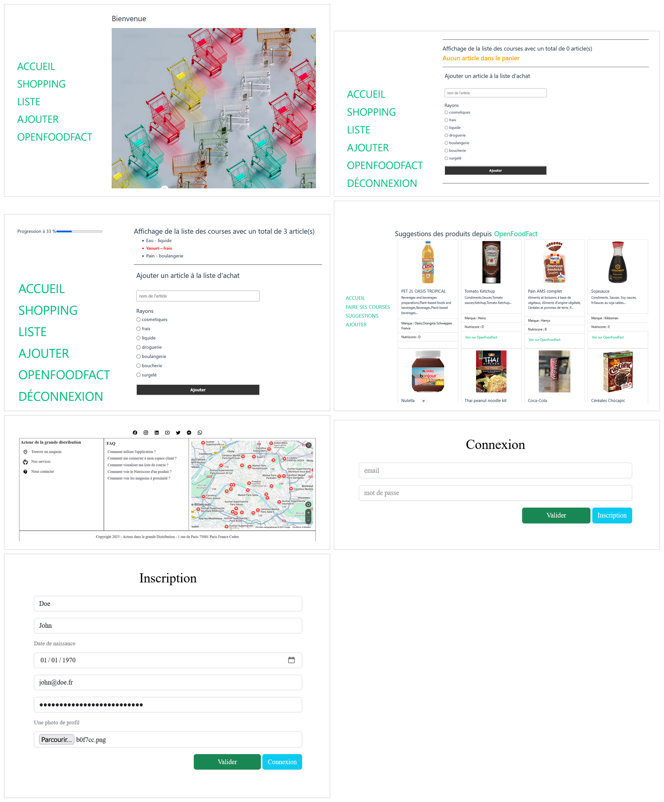

# TP Validation des acquis : liste de courses

***LISEZ L'ENONCÉ dans son intéhralité avant de commencer***

---

## Objectifs

- [x] Connectez l'application JS fournit depuis cette [ressource](./app.zip) à une API REST à développer en Node pour stocker les utilisateurs, les produits, etc. dans une base de données *MongoDB*
- [x] Mettez en place des tests automatisés de votre application

---

## Spécifications techniques et fonctionnelles

- Effectuez d'abord vos requêtes vers le back-end avec l'extension VS Code **`ThunderClient`** ou **`Postman`** ou **`Curl`** dans un premier pour gagner du temps lors du développement. Le lien entre le *Front* et le *Back* pourra s'effectuer une fois que votre code sera *API* sera fonctionnelle.
- Utilisez le *Cloud de MongoDB ou votre serveur local avec Docker* et l'extension *VS Code MongoDB* pour la base de données

##### Aide utilisation de l'*API OpenFoodFact*

- [Exemple d'utilisation depuis l'*URL https://world.openfoodfacts.org/api/v3/product/737628064502.json*](https://world.openfoodfacts.org/api/v3/product/737628064502.json), avec ***737628064502*** identifiant unique d'un produit. Il vous suffit de remplacer cet identifiant par celui du produit recherché depuis le site d'*OpenFoodFact*.
- Quelques identifiants des produits d'*OpenFoodFact*
```js
const codes = [
  '3017620425035',
  '3274080005003',
  '5449000214911',
  '8002270014901',
  '7613034626844',
  '737628064502',
  '3228857000906',
  '87157215',
  '3124480191182',
  '80052760',
  '8715035110106'
]
```

##### Exemples non contractuels de l'application finale

Vous êtes libre de faire ce que vous voulez au niveau du *UI* tant que les cas d'utilisation sont respectés



---

## Énoncé

1. Créez une application Web permettant un utilisateur de **réaliser une liste de courses** en mettant en place une *API REST* avec *Node*
  - Gérez l'ajout, lecture, modification et suppression (opération *CRUD : Create, Read, Update et Delete*) d'un produit
  - Utilisez un client ***HTTPS*** pour récupérer les informations de l'*API OpenFoodFact*
  - Gérez l'inscription d'un utilisateur
  - Gérez la connexion d'un utilisateur

2. Stockez les informations métiers (utilisateurs, produits, listes, etc.) dans une base de données ***MongoDB***

3. Testez votre projet avec l'implémentation des **tests automatisés** en utilisant les modules de votre choix entre *Mocha, Jest, Vitest, Supertest, Cypress*, etc.

---

## Bonus

4. Mettez en place une liste de course en *live*, elle est partagée et mise à jour en direct par plusieurs utilisateurs en utilisant la librairie [Socket.IO](https://socket.io/)
